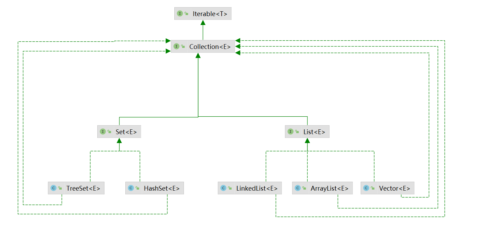
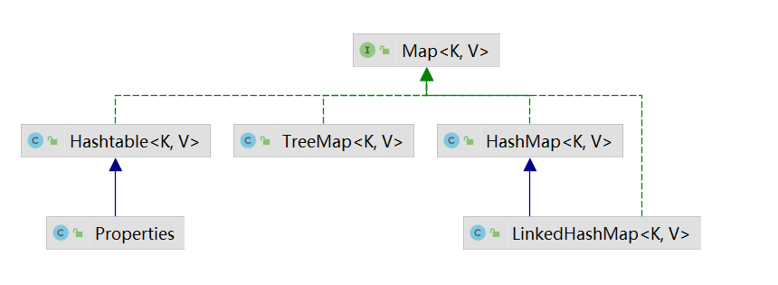
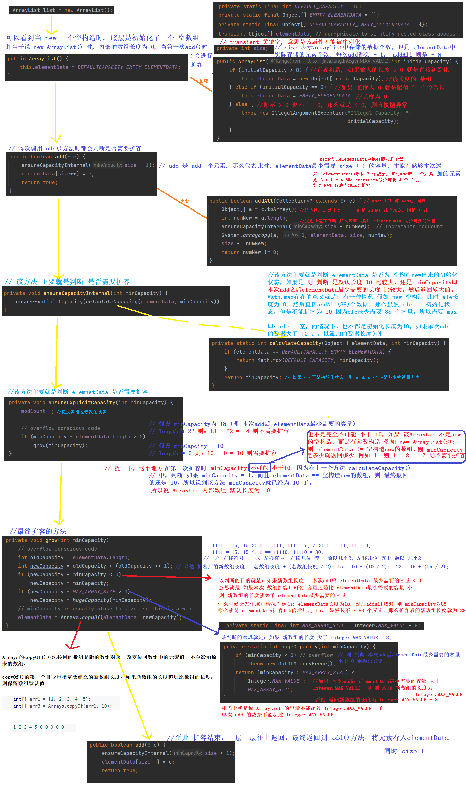
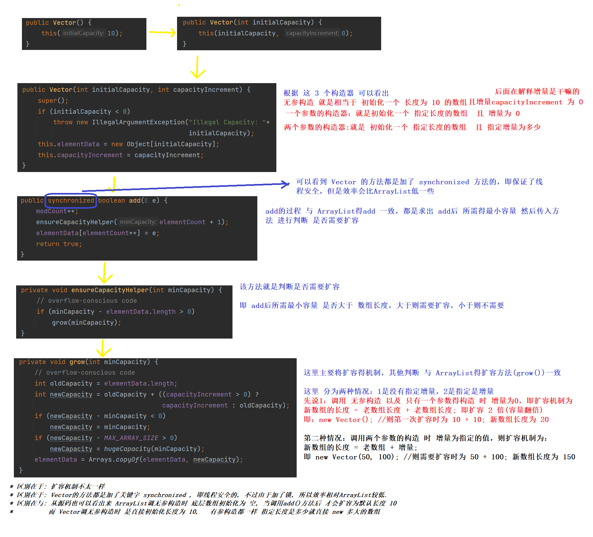
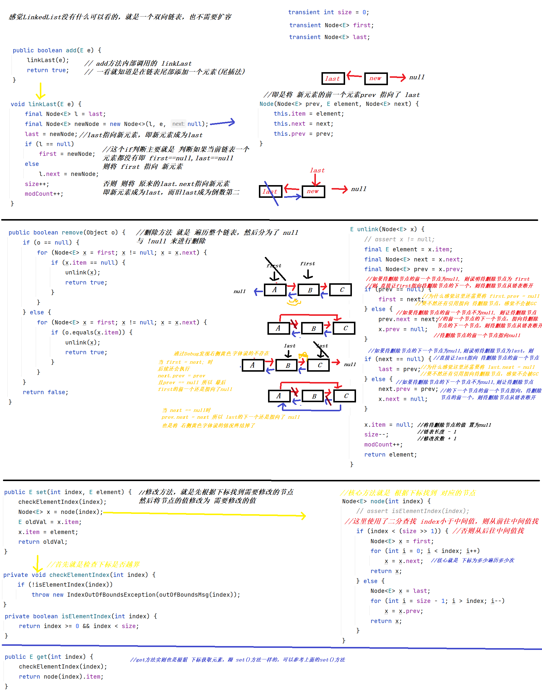
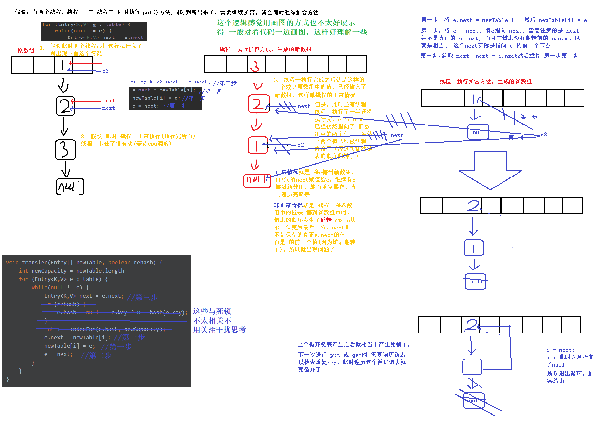
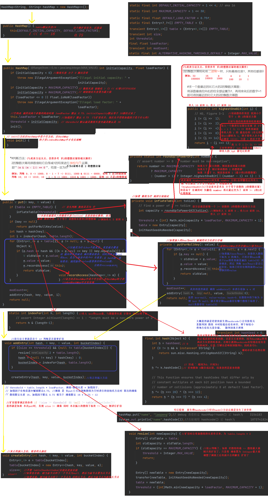
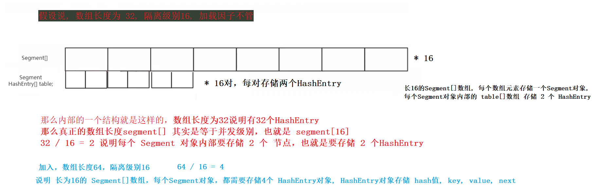

# Java集合专题

> 作者: LaoPeng
>
> 2022/7/3 17:29 始


# 集合体系图

这两个图是需要记住得。(虚线代表实现) (实线代表继承)               (idea还是不太智能, 关系多了线就很乱, 我调整了好久，强迫症哈哈哈)





# ArrayList扩容机制


# Vector扩容机制


# LinkedList


想要找到好的教程不难，找到适合自己的还真不好找，韩老师讲的挺不错，就是太啰嗦了，就相当于是给小白讲的Java基础中 第一次学集合的小伙伴讲的
不太适合我，一个HashSet源码讲解，前置4个视频铺垫，将HashSet的方法，HashSet底层的HashMap是kv对，无序不能重复。是数组 + 链表的形式
我感觉讲HashSet前应该先讲HashMap好些吧。溜了我直接去找讲解HashMap源码的了.

# HashMap 1.7
大家都知道 HashMap是由数组 + 链表实现。
老师问了一个问题为什么 HashMap的数组部分 不像 ArrayList一样，顺序存放数据 即 0 ~ 8, 然后数组满了之后 继续 0 ~ 8,  相同下标的根据链表next存储？

我刚想到这个问题的时候，感觉这种方法也挺好的，不用计算hash值，而且非常散列。直到老师说这种方法插入快的一B。那么实际这种方式 查询效率 是非常低的， 
因为HashMap正常计算Hash值然后存入数组，这样**查询的时候可以直接计算出Hash值，然后去对应的链表中查询**(相当于只用了 1/8 的时间，这不比二分查找快多了)
然而如果采用问题的方式存储，**那么就只能 8 个链表挨个遍历**，可想而知非常慢(假设数组长度为 8)

HashMap1.7插入链表的方式是采用**头插法**这样效率高些，免得还需要遍历到链表尾部再插入(但是实际上是，put时不管头插还是尾插都需要遍历链表来检测是否key会重复，
如果key没有重复，那么也是遍历到链表尾部了，如果key重复了，则都是遍历一半就替换掉key重复了的节点中的value值，然后返回)

以前只知道put方法插入相同的key，会把value值替换掉，没想到还会返回旧的value值，如果返回null则说明key没有重复没有进行替换，所以**可以使用put的返回值验证当前key是否存在**

为什么hashMap数组的容量一定得是 2得幂次方数呢?  (简单说就是为了保证下标 在 0 ~ 数组长度-1 之间不越界, 如16 则保证下标在 0 - 15)  (在数组扩容的时候也有好处到时候再说)
```java
private void inflateTable(int toSize) { //传入toSize得是 threshold, 而threshold在构造方法中被赋为数组长度
    // Find a power of 2 >= toSize
    int capacity = roundUpToPowerOf2(toSize);//获取 >= toSize得 2得幂次方数 (传入 5返回8, 传入10返回16，传入17返回32)
        
    // 这行就是计算出threshold(阈值), 阈值=数组长度 * 加载因子(默认0.75) 后面的话估计就是根据该阈值
    threshold = (int) Math.min(capacity * loadFactor, MAXIMUM_CAPACITY + 1);
    table = new Entry[capacity];//初始化指定长度得数组
    initHashSeedAsNeeded(capacity);
}

/**
 * 方法得作用 是 传入 key得hash值 与 数组得长度 计算出 该key在数组中对应得下标
 * 那么这个 index 是有条件得:
 *      1. 得在数组长度内 比如数组长度 16, 则index: 0~15
 *      2. 平均
 * 之前 我们模拟的这个hashmap计算出下标是通过 取余的方式 h % 16; 这样也只会产生 0-15 的数, 但是可能不够平均(不够散列)
 * 那么此处就是使用  & 的方式  h & (length - 1); 也只会产生 0-15的值. 为什么?
 * 假设: 数组长度为 16 => 0001 0000;   16 - 1 = 15 => 0000 1111;   随机的一个hash值 h => 0101 0101
 * 16: 0001 0000                32: 0010 0000
 * 
 * 15: 0000 1111                31: 0001 1111
 * h:  0101 0101                h:  0101 0101
 * &                            &
 *     0000 0101                    0001 0101
 * 
 * 有没有发现什么 为什么数组的容量一定得是 2得幂次方数呢?
 * 先说上面的一个结论就是 不管hash值是多少 与 数组长度 - 1 进行 & 运算后, 得出的结果都是 hash值的 低几位,
 * 如数组长度 16 则取hash值的低4位, 就算4位全部是1, 那也只是 1111 => 15 不会超过数组长度 16 刚好满足 0-15
 * 如数组长度 32 则取hash值的低5位, 就算5位全部是1, 那也只是 11111 => 31 不会超过数组长度 32 刚好满足 0-31
 * 
 * 2得整次幂转为 二进制有一个特征即: 只有最高位是1, 其他位都是0,        比如: 1, 10, 100, 1000, 10000 分别对应 1, 2, 4, 8, 16
 * 那么 这些数 - 1 后也是存在一个特征的: 原本的最高位变为0, 其他位都是1, 比如: 0, 01, 011, 0111, 01111 分别对应 0, 1, 3, 7, 15
 * 而 & 操作是  全1为1, 所以 hash值 与 2的幂次方 - 1 进行 & 运算 实际是获取了 hash值低位的数值, 而且不会超出数组长度
 * 
 * 没想到短短几行代码 蕴含着 如此奥秘的逻辑 (感觉说的可能不是很清楚, 虽然已经明白了, 但是不太好说出来)
 * 
 * 
 */
static int indexFor(int h, int length) {
    // assert Integer.bitCount(length) == 1 : "length must be a non-zero power of 2";
    return h & (length-1);
}


/**
 * Retrieve object hash code and applies a supplemental hash function to the
 * result hash, which defends against poor quality hash functions.  This is
 * critical because HashMap uses power-of-two length hash tables, that
 * otherwise encounter collisions for hashCodes that do not differ
 * in lower bits. Note: Null keys always map to hash 0, thus index 0.
 * 
 * 检索对象哈希代码，并对结果哈希应用一个补充哈希函数，以防止低质量的哈希函数。这是至关重要的，
 * 因为HashMap使用两次方长度的哈希表，否则会遇到hashcode在较低位没有差异的冲突。注意:空键总是映射到散列0，因此索引0。
 * 
 * 用自己的话说就是: 如果使用原生的hashcode() 那么在低位的冲突会比较严重, 因为一个hashcode()产生的hash值 是int型的, 显然有 32bit
 * 但是 如果数组长度为 16 那么最终根据 hash计算数组下标时
 * 16: 0001 0000                32: 0010 0000     (这里需要结合上面的 indexFor() 方法进行理解)
 * 
 * 15: 0000 1111                31: 0001 1111
 * h:  0101 0101                h:  0101 0101
 * &                            &
 *     0000 0101                    0001 0101
 * 
 * 是 这样的, 就是说不管 hash值有多长 最后与 15 的二进制进行 & 运算时, 只需要hash值后4位的值, 即此处的 0101, 因为15是1111 那么hash值高位的值不管是 0 和 1
 * 和 15 进行 & 运算, 显然结果都是 0 (因为 15 高位都是 0), 所以说 很容易发生冲入 32bit的一个hash值, 在数组长度16的情况下, 只用到了后4bit, 那能不冲突才怪呢.
 * 比如说 key1的哈希值 1111 1001 0101, key2的哈希值 0000 0110 0101, 那么由于 后4位一致, 显然在数组中的下标是5, 前面那么多值不一样... 所以说很容易冲突
 * 
 * 那么怎么样才能减少冲突? 显然只要把 高位数 参与到 最终计算数组下标的运算中去就ok了. 也就是这两行
 *     h ^= (h >>> 20) ^ (h >>> 12);
 *     return h ^ (h >>> 7) ^ (h >>> 4);
 * 一顿操作 疯狂右移, 异或 虽然看不懂, 但是 效果就是 根据 hashcode()(整个hash值 包括高位与低位)生成一个 新的hash值, 用这个hash值去进行计算 数组下标, 就是说 结果非常散列
 * 封装了一个HashMap内部的 生成hash值的方法 hash()
 * 
 */
final int hash(Object k) {
    int h = hashSeed;
    if (0 != h && k instanceof String) {
        return sun.misc.Hashing.stringHash32((String) k);
    }

    h ^= k.hashCode();
    
    // This function ensures that hashCodes that differ only by
    // constant multiples at each bit position have a bounded
    // number of collisions (approximately 8 at default load factor).
    // 这个函数确保hashcode在每个位位置上的差异仅为常数倍，冲突的次数是有限制的(默认负载因子约为8)。
    h ^= (h >>> 20) ^ (h >>> 12);
    return h ^ (h >>> 7) ^ (h >>> 4);
}
```

**扩容**
```java
// 在put方法中 是调用该方法来进行添加元素的
void addEntry(int hash, K key, V value, int bucketIndex) {
    // 扩容条件: 满足 size >= 阈值 同时 本次插入的数组下标处 != null 才会触发扩容
    if ((size >= threshold) && (null != table[bucketIndex])) {
        resize(2 * table.length);// 调用该方法进行扩容, 扩容大小为 原数组长度的两倍
        
        hash = (null != key) ? hash(key) : 0;// 扩容后, 使用之前的hash值

        /**
         * 扩容后使用之前根据 (hash值 & table.length - 1) 计算出来的数组下标 就不太好使用了. 因为数组长度发生了改变, 那么计算出来的值就不一样了,
         * 必须的使用新的值, 要不然 下次get("key")时 根据key的hash值 + 数组长度计算出来的 下标, 然后去该下标对应的元素链表中去遍历可就找不到该key了哈哈哈
         */
        bucketIndex = indexFor(hash, table.length);
    }

    createEntry(hash, key, value, bucketIndex);
}


void resize(int newCapacity) {// 传入的新数组的长度  (原数组长度 * 2)
    Entry[] oldTable = table;
    int oldCapacity = oldTable.length;

    //此处判断的是 旧数组的长度如果 == 数组最大值, 则不进行扩容, 将阈值调整为Integer.MAX_VALUE;
    // (因为已经达到最大值了不能扩容了, 调整阈值为Integer最大值,相当于间接扩容, 相当于暂时不会触发扩容, 再触发扩容也阔不了了)
    if (oldCapacity == MAXIMUM_CAPACITY) {
        threshold = Integer.MAX_VALUE;
        return;
    }

    Entry[] newTable = new Entry[newCapacity];//根据新的数组长度, 创建出新数组
    transfer(newTable, initHashSeedAsNeeded(newCapacity));//将旧数组中的所有数据 copy 到新数组
    table = newTable;// 将新数组赋值给 table, 那么就是完成了一次扩容 table已经变为了扩容后的数组了
    threshold = (int)Math.min(newCapacity * loadFactor, MAXIMUM_CAPACITY + 1);//由于数组扩容了, 所以 新的数组长度 * 加载因子, 重新计算 阈值
}

// 单线程下该方法 重新计算旧数组+链表中元素的新的下标, 然后存储到新数组中是没有问题的
void transfer(Entry[] newTable, boolean rehash) {
    int newCapacity = newTable.length;
    for (Entry<K,V> e : table) {//遍历旧的数组
        while(null != e) {//如果数组中不为null, 则继续遍历该链表 (为扩容前老数组+链表中的元素 找到在新数组中的位置并存放)
            Entry<K,V> next = e.next;
            
            /**
             * 这个 rehash 大部分情况为 fasle, 那么这个rehash怎么来的,
             * 就得看 谁调用本方法传入的什么了 那么此处显然是 resize()方法(就在上面)调用的本方法 transfer(newTable, initHashSeedAsNeeded(newCapacity));
             * 那么主要就是看 initHashSeedAsNeeded(newCapacity); 方法 返回的 true 还是 false, 则此处的 rehash 就是 true 还是 false
             * initHashSeedAsNeeded(newCapacity);的介绍方法下面了.
             * initHashSeedAsNeeded(newCapacity);返回true或者false是取决于哈希种子是否发生改变, 改变则为true, 没改变就是false
             * hash()方法在计算hash值时 最核心的一句是 hashSeed ^= k.hashCode();
             * 所以如果 hashSeed 发生改变, 那么元素的 hash值显然也是发生变化了
             * 所以此处就是 判断哈希种子是否被修改, 如修改了 则需要根据元素的key的hashcode 与 新的hashSeed 计算出 新的hash值
             */
            if (rehash) {
                e.hash = null == e.key ? 0 : hash(e.key);
            }

            /**
             * 扩容后使用之前根据 (hash值 & table.length - 1) 计算出来的数组下标 就不太好使用了. 因为数组长度发生了改变, 那么计算出来的值就不一样了,
             * 必须的使用新的值, 要不然 下次get("key")时 根据key的hash值 + 数组长度计算出来的 下标, 然后去该下标对应的元素链表中去遍历可就找不到该key了哈哈哈
             * 可以发现 有两种情况：
             *      一种就是 扩容前下标为 5 扩容后 下标变为 21, 这是因为 数组长度发生改变 进行 & 运算后值自然不一样, 数组长度只会是2的整数幂, 扩容也只是长度 * 2
             *          15的二进制 与 31的二进制  实际也就是 左边最高位多了一位 一个是 1111 一个是11111 多了一个最高位 在此处为 16 (也就是oldTable.length)
             *          那么如果 hash值的 这一位 也是 1 那么扩容就是为 0101 => 5 扩容后为 10101 => 21
             *          这种情况的实质就是 原下标 + 老数组.length = 新下标 (因为扩容是翻倍(原数组.length * 2), 二进制数进一位实质也是翻倍 1111是15, 11111是31, 最高位是16 也是原数组长度)
             *      第二种情况就是 hahs值的 这一位 是 0, 那么扩容就是为 0101 => 5 扩容后为 0101 => 5
             *      这就是第二种情况 扩容前下标是多少 扩容后下标也是多少
             *      
             *      
             * 16: 0001 0000                32: 0010 0000                           16: 0001 0000                32: 0010 0000
             *
             * 15: 0000 1111                31: 0001 1111                           15: 0000 1111                31: 0001 1111
             * h:  0101 0101                h:  0101 0101                           h:  0100 0101                h:  0100 0101
             * &                            &                                       &                            &
             *     0000 0101 => 5               0001 0101 => 21                         0000 0101 => 5               0000 0101 => 5
             *                                  (实际是 此处 + 的是 旧数组.length 也就是 16)
             */
            int i = indexFor(e.hash, newCapacity);//根据新的数组长度 使用 (hash值 & table.length - 1) 计算出新的数组下标
            
            // 这两步就相当于完成一个链表的头插法, 将e的下一个元素 指向 新数组中e对应下标的元素, 
            // 然后将 新数组中e对应下标的地方赋值为 e, 即完成一次头插法, 即 将待插入节点e的下一个指向 头节点newTable[i], 然后头节点再指向e, 这样e就成为头节点了而且e.next指向旧的头节点
            // 使用头插法插入, 从老数组 到 新数组后 有一个特点, 就是 链表顺序会发生反转, 老数组中存储的 1->2->3->null 到新数组就变成了 3->2->1->null
            e.next = newTable[i];
            newTable[i] = e;
            
            e = next;//将 e 指向的节点存储到 新数组后, e 被赋值为 老数组中的下一个元素, 进行遍历, 直到将老数组中的所有值全部转存到新数组
        }
    }
}

/**
 * 该方法呢, 就是传入一个数组长度, 然后判断是否要 修改 hashSeed 哈希种子, 将是否修改的boolean值返回扩容方法,
 * 扩容方法决定是否要 根据新的hashSeed, 重新计算新的hash值 (hashSeed如果被修改了, 肯定要重新计算hash值
 * 
 * 该方法不仅在 扩容中被调用了, 在初始化化数组时, 也是调用了的, 作用一致, 计算出hashSeed
 * 
 * hashSeed大部分情况默认为 0, 如果设置了JVM参数 jdk.map.althashing.threshold, 才有可能会触发 hashSeed被修改, JVM参数不变的情况下, 数组长度发生改变也可能会触发 hashSeed被修改
 * 那么修改 hashSeed的的作用就是 使得 hash()函数在计算 元素hash值时, 计算出来的hash值存放到数组中时会更加 散列
 */
final boolean initHashSeedAsNeeded(int capacity) {
    boolean currentAltHashing = hashSeed != 0; // hashSeed 默认为 0, 那么意思就是此处默认是 currentAltHashing = false
    boolean useAltHashing = sun.misc.VM.isBooted() && // 判断jvm是否启动，开始运行为true, (相当于永远为true)
        (capacity >= Holder.ALTERNATIVE_HASHING_THRESHOLD);//此处 就是根据 数组长度 是否大于等于 Holder.ALTERNATIVE_HASHING_THRESHOLD 
        // 该 Holder.ALTERNATIVE_HASHING_THRESHOLD 是通过 JVM参数 jdk.map.althashing.threshold 来判断的, 如果手动设置JVM参数 jdk.map.althashing.threshold,
        // 那么 Holder.ALTERNATIVE_HASHING_THRESHOLD 的值就是 jdk.map.althashing.threshold的值, 如果没有设置 jdk.map.althashing.threshold 的值
        // 则 Holder.ALTERNATIVE_HASHING_THRESHOLD 的默认值为 Integer.MAX_VALUE
        // 所以如果设置了JVM参数值, 数组长度有可能 >= JVM参数, 有可能为true, 有可能会修改hashSeed
        
    boolean switching = currentAltHashing ^ useAltHashing;//异或操作 不同为1, 相同为0, 意思就是必须 一true, 一fasle才会返回true
    if (switching) {
        // hashSeed 没有在其他地方操作的, 只有这里会对hashSeed进行赋值
        // 只有当 switching 为true了, 才会修改hashSeed种子的值
        // 修改哈希种子值的目的就是 觉得HashMap默认的算法不太好, 不够散列, 所以修改hashSeed, 在计算hash值时 生成更加散列的hash值
        // (具体得看hash()方法, hash()方法中计算hash值 是根据 hashSeed ^= k.hashCode(); 然后经过一 右移 与 异或操作 得到的hash值)
        // 所以修改了 hashSeed, hash值会发生改变
        // 所以在数组扩容时, 数组的长度发生了改变, 所以hashSeed也有可能发生改变, hashSeed是否改变将boolean返回, 告诉扩容方法
        // 扩容方法决定是否要 重新计算元素的hash(根据新的哈希种子 计算新的hash值)
        hashSeed = useAltHashing
            ? sun.misc.Hashing.randomHashSeed(this)
            : 0;
    }
    return switching;
}
```

**1.7多线程环境下: 扩容时会发生死锁**
那么我认为最主要的原因就是 扩容前链表的顺序是 1->2->3->null, 扩容后 3->2->1->null 就导致会产生一个循环链表, 导致死循环


**如何避免扩容时, hashmap产生死锁**
只有一个办法, 防止hashmap产生扩容: 比如说确定了这个hashmap使用过程中不会put进入超过30个元素, 那么new HashMap得时候就可以根据有参构造 
`new HashMap(64, 0.75)`, 传入得数组长度 与 加载因子 来控制使 **阈值**不要超过 30(阈值=数组长度*加载因子), 那么就永远不会扩容 因为扩容得条件是 size >= 阈值,
另一种不算方法得方法就是, 避免在多线程环境下使用HashMap 或者说 在使用HashMap前对上层 进行加锁等控制, 保证同时只有一个线程能操作HashMap

**get()方法**
```java
/**
 * get方法比较简单
 */
public V get(Object key) {
    // 若 key == null 则调用 专门获取null得方法获取值 (存储key=null得元素时 也是专门得方法)
    if (key == null)
        return getForNullKey();
    Entry<K,V> entry = getEntry(key);//获取key存储得元素得值 (这里返回得entry是一个节点, 真正得数据是 entry.getValue())

    return null == entry ? null : entry.getValue();//entry != null 才会返回 真正得value值
}

/**
 * 获取 key = null 得元素得值
 */
private V getForNullKey() {
    if (size == 0) { // 如果元素个数 == 0则直接返回null, 就是一个简单得安全判断
        return null;
    }
    //在存储key=null得方法中, 由于key=null无法计算hash值, 所以 key=null得元素是直接存储在 table[0] 中得, 所以取值也是直接遍历 table[0]
    for (Entry<K,V> e = table[0]; e != null; e = e.next) {
        if (e.key == null) // 在table[0] 中挨个比对 key == null 找到了则 将对应得元素返回
            return e.value;
    }
    return null;//找不到则返回null
}

/**
 * 
 */
final Entry<K,V> getEntry(Object key) {
    if (size == 0) { // 如果元素个数 == 0则直接返回null, 就是一个简单得安全判断
        return null;
    }

    int hash = (key == null) ? 0 : hash(key);//计算出 key 得hash值.
    
    // 根据 hash值找到该key对应得数组下标 indexFor(hash, table.length)
    // 然后遍历该 数组元素处得链表, 挨个比对 满足 (元素中存储得hash值 与 key计算出来得hash值一致) 同时 (key == key 或者 (key != null 同时 key.equals(k)) 则返回e返回
    // 据我分析 e.hash == hash 是必须满足得, 也就是说 key 得hash值必须一致
    // (k = e.key) == key 这段是比较地址, 那么应该就是 判断 key值是一个对象得情况
    // (key != null && key.equals(k)) 这段 使用equals 应该是 判断 key值是一个 字符串得情况
    // 除了 e.hash == hash hash值必须一致外, 还需要满足 上述了两个条件之一, 即key值是对象需满足 (k = e.key) == key, key值是String需满足 (key != null && key.equals(k))
    for (Entry<K,V> e = table[indexFor(hash, table.length)]; e != null; e = e.next) {
        Object k;
        if (e.hash == hash && ((k = e.key) == key || (key != null && key.equals(k))))
            return e;
    }
    return null;
}
```

**HashMap中的属性 modCount 与 java.util.ConcurrentModificationException 异常 出现的原因**
```java
package org.pjj.map1_7;

import java.util.HashMap;
import java.util.Iterator;

/**
 * HashMap中的属性 modCount 与 java.util.ConcurrentModificationException 异常 出现的原因
 * 
 * @author PengJiaJun
 * @Date 2022/07/08 20:58
 */
public class HashMapSource2 {
    public static void main(String[] args) {
        HashMap<String, String> hashMap = new HashMap<>();
        hashMap.put("1", "1");
        hashMap.put("2", "2");

        // 出现异常 java.util.ConcurrentModificationException
//        for(String key : hashMap.keySet()) {
//            if(key.equals("2")) {
//                hashMap.remove(key);
//            }
//        }


        /**
         * 上面这段代码编译后是这样的 (foreach底层也是 iterator 实现的, 所以说编译后是这样的)
         *
         * 为什么会出现异常 java.util.ConcurrentModificationException ?
         * 首先先看 这个 Iterator 迭代器对象是哪里来的
         * hashMap.keySet().iterator() 看看keySet()对象哪里来的, 点进去看看就是这样的
         * keySet = new KeySet() 可以看到实质是new了一个 KeySet() 构造器, 点进去看看
         * iterator() return newKeyIterator(); 可以看到 这个 KeySet()对象的 iterator()方法返回的迭代器是调用 newKeyIterator() 获取的, 点进去看看
         * new KeyIterator() 发现内部是 new的一个 KeyIterator() 迭代器, 点进去看看
         *     private final class KeyIterator extends HashIterator<K> {
         *         public K next() {
         *             return nextEntry().getKey();
         *         }
         *     }
         *      发现继承自 HashIterator 迭代器, 由于初始化该类, 会先调用父类的构造方法, 所以点进去看看
         *      expectedModCount = modCount; 发现HashIterator迭代器的构造方法中将  HashMap中的 modCount属性赋值给了 expectedModCount
         *      那么此时 HashMap是调用了两次 put() 方法 所以 modCount = 2; (modCount表示被修改的次数, put, remove 都会导致modCount++)
         *      那么此时 modCount = 2; expectedModCount = 2;
         *
         *      发现重写了 next()方法, next方式实质先需要调用 nextEntry()方法, 点进去看看
         *          if (modCount != expectedModCount)
         *              throw new ConcurrentModificationException();
         *      发现 nextEntry()方法中 会先判断 mouCount != expectedModCount就会抛出异常.
         * 那么到这里, 基本上也就解谜了, 在迭代器构造方法中 expectedModCount被赋值为 2, 当调用 next()方法时 2 == 2; 没有问题
         * 然后执行 hashMap.remove(key) 当, 该元素被删除后, HashMap的remove()方法中 会mouCount++,
         * 然后继续循环, 执行 next()方法, 然后啪 2 != 3 (modCount = 3; expectedModCount = 2;), 那么就是抛出了 java.util.ConcurrentModificationException
         *
         * 解决就是使用 这个迭代器提供的 remove() 方法删除当前元素
         * remove()方法中有一行 expectedModCount = modCount; 那么就是 在删除完当前元素后,modCount不是会++嘛, 所以 expectedModCount = modCount;
         * 就不会出现 modCount = 3; expectedModCount = 2; 的情况了, 而是 modCount = 3; expectedModCount = 3;
         *
         * 对应的解决方法还有第二种, 就是使用 concurrentHashMap(), 多线程环境下的 HashMap
         *
         */
        Iterator i$ = hashMap.keySet().iterator();//该迭代器真正的类型 KeyIterator extends HashIterator<K>

        while(i$.hasNext()) {
            String key = (String)i$.next();
            if (key.equals("2")) {
//                hashMap.remove(key);
                i$.remove();
            }
        }

    }
}
```
**HashMap1.7完结**
原本准备想像ArrayList一样将代码的介绍都直接画在图上的, 但是感觉位置不够大, 要说的东西太多了, 画图不方便, 所以这个图画了一半还有一半以代码的形式贴在该文件上了


# ConcurrentHashMap 1.7
```java
//先理解下 concurrentHashMap 底层的一个结构

final Segment<K,V>[] segments;// 这个有点类似 HashMap中的 table[] 但是不是, 这个只是用来存储 segment 的
transient volatile HashEntry<K,V>[] table;// Segment内部的一个属性, 用来存储HashEntry, 也就用来真正存储节点

static final class HashEntry<K,V> {// 该hashEntry是真正存储数据的, 与 HashMap中的 Entry一样
    final int hash;//hash值
    final K key;//key
    volatile V value;//value
    volatile HashEntry<K, V> next;//next
    //可以说与 HashMap中的entry对象一模一样
}

static final int DEFAULT_INITIAL_CAPACITY = 16;
static final float DEFAULT_LOAD_FACTOR = 0.75f;
static final int DEFAULT_CONCURRENCY_LEVEL = 16;
// 默认构造器
public ConcurrentHashMap() {
    //三个参数分别为: 数组的长度, 加载因子, 隔离级别 (前两个与HashMap的构造器一样, 隔离级别是此处新有的)
    // 数组的长度默认16, 加载因子默认16, 隔离级别默认16
    this(DEFAULT_INITIAL_CAPACITY, DEFAULT_LOAD_FACTOR, DEFAULT_CONCURRENCY_LEVEL);
}
```


**先简单的看一下构造方法**
```java
public ConcurrentHashMap() {
    this(DEFAULT_INITIAL_CAPACITY, DEFAULT_LOAD_FACTOR, DEFAULT_CONCURRENCY_LEVEL);
}
public ConcurrentHashMap(int initialCapacity,float loadFactor, int concurrencyLevel) {
    if (!(loadFactor > 0) || initialCapacity < 0 || concurrencyLevel <= 0)
        throw new IllegalArgumentException();
    if (concurrencyLevel > MAX_SEGMENTS)
        concurrencyLevel = MAX_SEGMENTS;
    // Find power-of-two sizes best matching arguments
    int sshift = 0;
    
    /**
     * 看看该ssize的作用是什么, 可以看到该构造器的最后几行有一行 Segment<K,V>[] ss = (Segment<K,V>[])new Segment[ssize];
     * 显然 Segment数组的长度是 ssize 决定的, 该while循环对ssize的值进行了赋值, 看看该while循环的作用是什么
     * ssize = 1, concurrencyLevel默认等于 16, 先不用管++sshift;
     * ssize等于1 小于 16, 进入循环 ssize等于2 小于16, 进入循环 ssize等于4 小于16, 进入循环 ssize等于8 小于16, 进入循环 ssize等于16 不小于16退出循环
     * 可以看到 ssize=16时退出了循环, 那么意味则 Segment数组大小为 16,
     * 可以发现 最终ssize等于 ssize >= 隔离级别 的2的幂次方数
     * (与HashMap中inflateTable()方法中 求大于等于输入的数组长度的2的幂次方数, 以求的真正的数组长度, 就是指定数组长度时 若指定的长度不为2的幂次方数, 则扩容为2的幂次方数)
     * 此处是采用 while + 移位的方式实现的, HashMap中是调用 Integer的highestOneBit()方法实现的(不需要循环, 通过多次移位)
     * 
     * 为什么 ssize 要是 2的幂次方数? 或者说 为什么 segment[]数组长度 要是 2的幂次方数?
     * 与HashMap一样, 是根据 key的hash值 与 segment[]数组长度 - 1, 进行 & 运算, 得到数组下标.
     * 
     */
    int ssize = 1;
    while (ssize < concurrencyLevel) {
        ++sshift;
        ssize <<= 1;
    }
    this.segmentShift = 32 - sshift;
    this.segmentMask = ssize - 1;//保存segment数组长度 - 1; 方面后面 (key.hashcode & segemnt.length - 1) 就变成了 (key.hashcode & segmentMask)
    if (initialCapacity > MAXIMUM_CAPACITY)
        initialCapacity = MAXIMUM_CAPACITY;
    
    /**
     * 可以看到 cap 最终是 Segemnt对象下的 table[]属性 的长度, 也就是每个 Segment对象下保存几条链表
     * cap 又是根据 c 得到的, 所以现在从 c 开始分析
     * 假设 该构造器传入的都是默认值 int initialCapacity = 16,float loadFactor = 0.75, int concurrencyLevel = 16
     * 那么 c = 16 / ssize(经过上面的while ssize最终的是是 >= 隔离级别的2的幂次方数 所以ssize = 16), c = 16 / 16, c = 1
     * if (c * ssize < initialCapacity) = if( 1 * 16 < 16) 不满足 所以 c还是 1;
     * cap 默认 = 2, cap最小值就为 2
     * while(cap < c) cap = cap << 1;//如果 cap < c 即翻倍, 直到不小于 c
     * while(2 < 1);// 不成立 所以 cap还是 2
     * 后面 根据 cap new出了 Segment元素内 table[cap]数组, 相当于 cap 指定了 Segment元素内数组的长度
     * Segment<K,V> s0 = new Segment<K,V>(loadFactor, (int)(cap * loadFactor),(HashEntry<K,V>[])new HashEntry[cap]);
     * 所以 Segment内 table[]数组的长度是有最小值的 即为 2
     * 不会出现 Segment[]数组长16, Segment元素内的数组长1, 组成的数组长度为16的结构
     * 
     * 假设 int initialCapacity = 17, float loadFactor = 0.75, int concurrencyLevel = 16
     * initialCapacity = 17 就表示说 指定 HashEntry 17 个, 即 Segemnt[]数组长16(根据ssize=16得来),
     * 那么每个 Segment元素内部 存储几个 HashEntry? 也就是 Segment元素内部 table[]数组 长度?
     * 难道每个Segment元素存储 1 个 HashEntry, 最后一个Segment元素存储 2 个 HashEntry?
     * 不管是带入 initialCapacity = 17, ssize = 16 来进行运算, 还是说 根据默认值 16, 16, 0.75f
     * 得到的结果都是 cap = 2;//默认的最小值
     * 即 每给 Segment元素存储 2 个 HashEntry, 即 Segment元素内部数组 table[] 长度为 2
     * 虽然指定长度为 17, 但是最少是保存 32 个元素
     * 
     * 如果说 initialCapacity = 33, 其他值默认, 即 ssize = 16
     * 那么带入值可以得到 cap = 4, 即 16 * 4 = 64, 相当于数组长度为 64, 每个Segment元素内部存储 4 个 HashEntry
     * 有点像 HashMap 指定长度为 17 扩容到 32, 指定 33 扩容到 64的那个味道了.
     * 
     */
    int c = initialCapacity / ssize;
    if (c * ssize < initialCapacity)
        ++c;
    int cap = MIN_SEGMENT_TABLE_CAPACITY;//static final int MIN_SEGMENT_TABLE_CAPACITY = 2
    while (cap < c)
        cap <<= 1;
    // create segments and segments[0]
    /**
     * Segment<K,V> s0 = new Segment<K,V>(loadFactor, (int)(cap * loadFactor),(HashEntry<K,V>[])new HashEntry[cap]);
     * 这里先提一点点扩容, 可以发现 new Segment()时将, 是将 阈值传过去了的 (int)(cap * loadFactor), cap是数组长度
     * 扩容: put一个kv对时, 先计算hash值属于哪个Segment下, 然后判断是否需要扩容, 如果需要扩容, 假设当前数组长度为2, 则new一个长度为4的数组,
     * 将老数组中的元素copy过去, 然后将 Segment下的 table[]属性指向 新数组, 即完成扩容, 其他Segment下table长度为2, 扩容后Segemnt下table长度为4
     * 
     * 
     * 提一下为什么此处要 new Segment[ssize]; 与 Segment<K,V> s0 = new Segment<K,V>(loadFactor, (int)(cap * loadFactor),(HashEntry<K,V>[])new HashEntry[cap]);
     * 为什么要 new Segment[ssize]; 比较好理解, 构造方法嘛, 确定了 Segment[]数组的长度, 那么就直接初始化嘛
     * 主要是为什么要new 一个 Segment0, 这就需要结合put方法讲一讲了, put时首先要根据 key的hash值计算出 在Segments中的下标, 假设下标为 7
     * 然后将 该HashEntry对象放入 Segment对象中的table[]数组, 在进行此操作前需要先判断 该Segments[7]是否为null,
     * (Segments数组初始化后 每个元素都是 null, 除了 Segments[0], S0已经new出来了而且UNSAFE.putOrderedObject(ss, SBASE, s0);已经给Segments赋值了)
     * 如果Segments[7]为null, 则需要根据 加载因子, 阈值, 内部数组的长度 new出一个  Segment对象, 那么这些参数都是要重新获取并计算的,
     * 不过由于保存了 Segments[0], 所以只需从 Segment[0] 获取即可, 这就是为什么要在初始化 Segments[]时给 S0 赋值
     * 
     */
    Segment<K,V> s0 = new Segment<K,V>(loadFactor, (int)(cap * loadFactor),(HashEntry<K,V>[])new HashEntry[cap]);
    Segment<K,V>[] ss = (Segment<K,V>[])new Segment[ssize];
    UNSAFE.putOrderedObject(ss, SBASE, s0); // ordered write of segments[0]
    this.segments = ss;
}
```

**put()**
```java
public V put(K key, V value) {
    Segment<K,V> s;
    if (value == null) //首先判断 value == null 直接抛异常, 这也说明了 CHashMap不能加入value为null的kv对
        throw new NullPointerException();
    int hash = hash(key);// 根据key计算出hash值 (主要就是 hashcoe ^ hashSeed 得到的hash值, 然后再各种左移右移异或)
    /**
     * segmentMask = Segengs[].length - 1; 数组长度 - 1
     * hash & 数组长度 - 1, 这种方式获取数组下标是正常的, HashMap中也正是这种方式
     * 
     * 为什么要将 hash >>> segmentShift ?
     * 是这样的, 首先要知道 segmentShift的值, 该值是在构造方法中赋值的, 即 this.segmentShift = 32 - sshift;
     * sshift是, 假如数组长度ssize为16, 则sshift为4, 因为2的4次方为16, 假如数组长度为32, 则sshift为5, 因为2的5次方为32
     * 则 数组长度为16, segmentShift = 32 - 4 = 28, 数组长度为32, segmentShift = 32 - 5 = 27
     * 
     * 假设 一个key哈希值为 (hash值是int型, int为4个字节, 即32位)
     * 01010101 01010101 01010101 01010101
     * 00000000 00000000 00000000 00000101        那么这是 hash值 右移 28位后的结果
     * 00000000 00000000 00000000 00001111        这是 数组长度 - 1
     * 
     * 看到这个就有点感觉了, 相当于是HashMap使用 hash值直接与数组长度 - 1, 进行&运算, 实际是取 hash值的后 几位(数组长度为16, 就是取后4位)
     * ConcurrentHashMap 相当于就是 取 hash值的 前几位(数组长度为16, 就是取前4位) (4位都是 1, 也只能是15, 满足了数组长度16, 下标 0 ~ 15)
     * 
     * 之后在Segment元素内部存储的时候, 就是使用 正常的hashMap的方式 数组长度 -1 & hash值, 实际就是取 低几位
     * 那么就相当于 确定Segments数组下标的过程是取hash值的高几位, 然后在Segment元素内部确实 HashEntry[] table 的下标时, 是取的低几位
     * 
     * 至于为什么确定Segments[]数组下标时采用hash值高位, 确定HashEntry[] table的下标时采用hash值的低位?
     * 我估计是这样的, 如果都取低位或者高位, 那么可能导致,  元素全部偏向一边 (元素都存在一起, 不够散列)
     * 即假如都取低位 0101, 则 元素在 Segments[]数组中存储的下标为5, 那么在Segment元素中的 HashEntry[] table 也存储在下标为 5 (假设长度有这么长)
     * 那么岂不是, Segments[]中下标为几, 则该Segment元素内部的table下标也为几, 就是说其他位置就浪费了, 不够散列
     * 
     * 为什么确定Segments[]数组下标时采用hash值高位, 确定HashEntry[] table的下标时采用hash值的低位?
     * 答案就是: 为了散列.
     * 
     */
    int j = (hash >>> segmentShift) & segmentMask;
    
    /**
     * 此处判断就是 根据 j 下标, 从Segments[j] 取出该元素, 如果为null, 则 s = ensureSegment(j), 为此处new一个Segment放进去, 然后返回Segment对象
     * 最后调用 Segment对象的 put方法, 将kv对, 放入Segment对象的 table[]数组中
     * 
     * UNSAFE.getObject(segments, (j << SSHIFT) + SBASE)) 通过这种方式取出数组元素是线程安全的, 这个UNSAFE我也不了解, 反正就是说底层不只使用了CAS算法,
     * 也有其他算法, 反正就是保证一个线程的安全, 我现在对这个 并发, 锁, 这一块还不太了解, 暂时就向上面那样理解就行了.
     * 
     * (j << SSHIFT) + SBASE) 以后会有很多这样的写法, SSHIFT 与 SBASE是怎么来的我也不太清楚, 反正挺复杂的.
     * 效果就是 取出 j 处下标的元素. UNSAFE.getObject(segments, (j << SSHIFT) + SBASE))
     * 
     */
    if ((s = (Segment<K,V>)UNSAFE.getObject          // nonvolatile; recheck
        (segments, (j << SSHIFT) + SBASE)) == null) //  in ensureSegment
        s = ensureSegment(j);//为此下标处new一个Segment放进去, 然后返回Segment对象
    return s.put(key, hash, value, false);
}

/**
 * 生成一个Segment对象, 放入指定下标处, 并返回
 * 那么该方法就是会发生并发问题的, 假如此时两个线程同时put两个不同的kv对, 但是下标都一样需要放入同一个 Segments 中, 
 * 此时两个线程都发现 Segments[k] 为空, 则会调用该方法创建 Segments对象,
 * 那么最终只有一个线程会创建Segment对象, 另一个线程则是拿到已经被创建好了的这个Segment对象, 所以该方法是安全的, 不会产生并发问题
 */
private Segment<K,V> ensureSegment(int k) {
    final Segment<K,V>[] ss = this.segments;
    long u = (k << SSHIFT) + SBASE; // raw offset
    Segment<K,V> seg;
    
    //这里就是判断一下, Segmnet[k] 处是否为null, == null 才继续生成Segment对象, 不为null则直接返回该 Segment对象(说明被其他线程已经创建了)
    if ((seg = (Segment<K,V>)UNSAFE.getObjectVolatile(ss, u)) == null) {
        /**
         * 这里就是根据 Segments[0]的内部数组长度 cap, 加载因子 lf, 阈值 threshold 来new出一个 Segment对象
         * (这也是为什么之前构造方法中为什么要先初始化一个 Segments[0], 就是为了之后new Segment对象时方便取值)
         * 但是 实际没有 new Segment对象, 只是将 new Segment对象的参数都准备好了, 
         * */
        Segment<K,V> proto = ss[0]; // use segment 0 as prototype
        int cap = proto.table.length;
        float lf = proto.loadFactor;
        int threshold = (int)(cap * lf);
        HashEntry<K,V>[] tab = (HashEntry<K,V>[])new HashEntry[cap];
        /**
         * 继续判断, 在经过了上面几步的操作后, 再次获取Segment[k] 处是否为null,
         * == null 才继续生成Segment对象, 不为null则直接返回该 Segment对象(说明被其他线程已经创建了)
         * */
        if ((seg = (Segment<K,V>)UNSAFE.getObjectVolatile(ss, u)) == null) { // recheck
            Segment<K,V> s = new Segment<K,V>(lf, threshold, tab);//new出 Segment对象
            while ((seg = (Segment<K,V>)UNSAFE.getObjectVolatile(ss, u)) == null) {//再次判断 Segment[k] 处是否为null
                /**
                 * 使用cas来真正将 Segment放入 Segment[k] 操作成功则返回
                 * 如果操作失败(操作失败大概率是其他线程将 Segment[k]处赋值了, 所以Segment[k] != null, 则操作失败), 则继续while 判断 Segment[k] 处是否为null,
                 * 如果为null, 则再次使用cas来真正将 Segment放入 Segment[k] 操作成功则返回
                 * 如果不为null, 则说明其他线程已经将 Segment[k] 处创建了 Segment对象并放入了数组, 则结束while循环并将 其他线程创建的Segment对象返回
                 * */
                if (UNSAFE.compareAndSwapObject(ss, u, null, seg = s))
                    break;
            }
        }
    }
    return seg;
}

/**
 * 该方法是 Segment 内部的 put() 方法
 * 也就是确定了 Segments[] 中的位置, 即哪个 Segment, 之后继续put, 将kv对存放在 Segment内部 HashEntry[] table; 中的哪个位置.
 */
final V put(K key, int hash, V value, boolean onlyIfAbsent) {
    /*
     * 该方法的目的就是, 在等待锁的时间内, 随便完成一些其他事情以节省时间, 比如 new HashEntry<K,V>(hash, key, value, null);
     * */
    HashEntry<K,V> node = tryLock() ? null : scanAndLockForPut(key, hash, value);
    V oldValue;
    try {
        // 这里是已经确定了 Segment 所以这里是 Segment内部, table 是一个属性 表示Segment内的一个数组
        HashEntry<K,V>[] tab = table;
        int index = (tab.length - 1) & hash;//数组长度 - 1 & hash值, 常规操作, 计算出下标
        /*
         * entryAt(tab, index)方法内部就一句话
         * return (tab == null) ? null : (HashEntry<K,V>) UNSAFE.getObjectVolatile(tab, ((long)i << TSHIFT) + TBASE);
         * 也就是使用 UNSAFE 安全的获取 table 中下标为 index 的元素
         * 之后的操作就是, 如果该元素为空, 则将本次put的HashEntry直接放到该table[index], 如果不为空, 则遍历判断是否有重复, 然后替换值
         * 如果没有重复, 则使用头插法, 将元素插入链表.
         * */
        HashEntry<K,V> first = entryAt(tab, index);
        for (HashEntry<K,V> e = first;;) {//遍历该元素, 即 table[index]; 该处的 HashEntry以及HashEntry.next
            if (e != null) {
                K k;
                // 如果 key值重复, 则将value值替换, 然后将老value值返回, 退出循环, 结束方法
                // 如果 找不到key值重复, 则继续遍历, 直至遍历到链表最后一个元素的下一个即为null, 然后交由 else 处理, 使用头插法, 将其插入链表
                if ((k = e.key) == key || (e.hash == hash && key.equals(k))) {
                    oldValue = e.value;
                    if (!onlyIfAbsent) {
                        // 如果该 onlyIfAbsent = true(那么此处!true, 即为false不会进入该if), 
                        // 则 key值重复也不会替换value值, 修改次数也不会++, 返回值直接为该value
                        e.value = value;
                        ++modCount;
                    }
                    break;
                }
                e = e.next;
            }
            else {
                if (node != null)
                    node.setNext(first);
                else
                    /*
                     * 如果说, table[index] == null, 则 new 出一个 HashEntry, HashEntry.next指向旧的头节点first, 不过是为null的, 然后将table[index] = HashEntry;
                     * 
                     * 或者是 table[index].next 下的某一个, 因为该for循环以及for循环内第一个if, 会遍历整个链表, 
                     * 也就是说当遍历到链表尾部时, 说明 没有重复的key, 那么该kv对就应该插入链表, 怎么插入?
                     * 先 new HashEntry(); 且该HashEntry.next指向 链表的头节点,
                     * 然后 table[index] = 该HashEntry; 这样就完成了一次头插法, 将元素插入链表
                     * 不过不是直接 table[index] = hashentry; 这样写的, 这样不安全, 文中实际的写法是
                     * setEntryAt(tab, index, node); 内部是 UNSAFE.putOrderedObject(tab, ((long)i << TSHIFT) + TBASE, e);
                     * */
                    node = new HashEntry<K,V>(hash, key, value, first);
                int c = count + 1;//先将 count + 1 的保存起来, 也就是 该 Segment存储元素的个数 先+1, 注意: 并没有将这个值直接修改count
                if (c > threshold && tab.length < MAXIMUM_CAPACITY) //这里判断 是否需要扩容
                    rehash(node);//扩容, 等下看
                else
                    // 如果不需要扩容, 则将 HashEntry保存到 table[index], 但是不能这样写, 这样写只是保存到了当前线程的工作空间
                    // 没有同步到内存, 所以需要使用 setEntryAt(tab, index, node); 将值同步到内存
                    // setEntryAt()内部就一句话 UNSAFE.putOrderedObject(tab, ((long)i << TSHIFT) + TBASE, e);
                    // 通过 UNSAFE 保证安全, 即通过该对象存储到 table[index], 是可以保证其他线程同步的
                    setEntryAt(tab, index, node);
                
                // 添加完成后就是, ++modCount; 修改次数+1, count = c; 存储数据个数真正 + 1;
                ++modCount;
                count = c;
                oldValue = null;//这个返回值, put相同的key会将老的value返回, 这里并没有重复, 所以返回值为null
                break;
            }
        }
    } finally {
        unlock();
    }
    return oldValue;
}

/**
 * tryLock(): 当前这把锁能不能获取到, 如果能直接返回 true 否则 直接返回 false (不会阻塞)
 * lock():    当前这把锁能不能获取到, 如果能直接返回 true 否则 阻塞 直到能获取到这把锁
 * 
 * 该方法的目的就是, 在等待锁的时间内, 随便完成一些其他事情以节省时间, 比如 new HashEntry<K,V>(hash, key, value, null);
 *
 * 说实话啊, 我也不太理解, 锁来锁去的, 并发, 锁, 这块还不太了解, 可能也是我没有认真听吧, 反正ConcurrentHashMap1.8我是不打算看了, 太勾八难了感觉
 * 虽然明白了这个构造器到这个put方法的一个流程, 也感觉明白了concurrentHashMap的一个结构, 但是感觉还是不是很明白, 就好像上数学课老师将的这个题目明白了
 * 但是换另外一题, 还是不会一样, 感觉HashMap1.7我就领悟的挺透彻的,
 */
private HashEntry<K,V> scanAndLockForPut(K key, int hash, V value) {
    HashEntry<K,V> first = entryForHash(this, hash);
    HashEntry<K,V> e = first;
    HashEntry<K,V> node = null;
    int retries = -1; // negative while locating node
    while (!tryLock()) {
        HashEntry<K,V> f; // to recheck first below
        if (retries < 0) {
            if (e == null) {
                if (node == null) // speculatively create node
                    node = new HashEntry<K,V>(hash, key, value, null);
                retries = 0;
            }
            else if (key.equals(e.key))
                retries = 0;
            else
                e = e.next;
        }
        else if (++retries > MAX_SCAN_RETRIES) {
            lock();
            break;
        }
        else if ((retries & 1) == 0 && (f = entryForHash(this, hash)) != first) {
            e = first = f; // re-traverse if entry changed
            retries = -1;
        }
    }
    return node;
}
```

**扩容**
```java
/**
 * 先看看在put中调用该扩容方法的时候
 * int c = count + 1;//相当于 put后, 该Segment存储的元素个数
 * if (c > threshold && tab.length < MAXIMUM_CAPACITY) //这里判断 是否需要扩容, (元素个数 > 阈值 且 数组长度 < 最大数组长度) 即进行扩容
 *      rehash(node);//扩容, 扩容时将 node 节点传入 node = new HashEntry<K,V>(hash, key, value, first);
 *      // 传入的时候 node.next 就已经指向了 头节点了, 但是还没有插入链表
 */
private void rehash(HashEntry<K,V> node) {
    HashEntry<K,V>[] oldTable = table;//先保存老数组
    int oldCapacity = oldTable.length;//保存老数组长度
    int newCapacity = oldCapacity << 1;//新数组长度 = 老数组 << 1; 即新数组长度 = 老数组长度 * 2;
    threshold = (int)(newCapacity * loadFactor);//根据新数组长度 * 加载因子 得到新的阈值
    HashEntry<K,V>[] newTable = (HashEntry<K,V>[]) new HashEntry[newCapacity];//根据新数组长度 new 出新的 数组
    int sizeMask = newCapacity - 1;//数组长度 - 1; 方便计算下标  hash & sizeMask = 下标
        
    // 此处即是遍历老数组, 将元素转移到新数组
    for (int i = 0; i < oldCapacity ; i++) {
        HashEntry<K,V> e = oldTable[i];
        if (e != null) {// e != null 才需要转移嘛, 如果说 e == null 则说明该 oldTable[i]处 为null, 则不需要转移此处的元素到新数组
            HashEntry<K,V> next = e.next;//保存 e 的下一个节点
            int idx = e.hash & sizeMask;//idx表示 e对象在 新数组中的下标
            if (next == null)   //  Single node on list
                // 如果 e 的下一个节点为null, 说明当前 oldTable[i]处 只有 e 一个节点, 则将 e 存储到对应的新数组中即可 newTable[idx] = e;
                // 而 e 没有下一个节点, 就相当于 oldTable[i] 该处的链表已经处理完了, 可以处理数组的下一个元素了即 oldTable[i + 1]
                newTable[idx] = e;
            else { // Reuse consecutive sequence at same slot
                HashEntry<K,V> lastRun = e;// e == oldTable[i] 相当于 头节点
                int lastIdx = idx;// lastIdx 相当于 e 的新下标(根据e.hash & sizeMask计算出来的) 
                /**
                 * 该 for循环的作用就是:
                 * 遍历该链表, 同时记录链表中的元素, 转移到新数组中后的下标(lastIdx) 以及 记录该元素(lastRun)
                 * 只要 当前遍历元素的新下标 != 当前遍历元素的上一个元素的新下标   if (k != lastIdx)
                 *      则 将 lastIdx 赋值为 当前遍历元素的新下标, 同时将 lastRun 赋值为当前记录元素
                 * 如果 当前遍历元素的新下标 == 当前遍历元素的上一个元素的新下标
                 *      则 什么都不操作
                 * 那么最后这样做的效果就是 lastRun代表的节点 往后的节点 在新数组中下标都是一样的,
                 * 因为 如果不一样, 则 lastRun就被置为了这个不一样下标的元素, 然后继续比较 与下一个元素的 新节点是一致
                 * 
                 * 那么该for循环结束时就会出线一种情况, 当链表遍历完之后, lastRun所指向的元素 往后的元素(需要满足是连续的) 在新数组中下标都是一样的
                 * 所以 该for循环结束后 newTable[lastIdx] = lastRun; 即将 lastRun直接移动到新数组的属于它自己的下标处
                 * 那么链在lastRun后面的节点, 也是直接跟这lastRun一起被移动到了 新数组新下标处, 由于lastRun后面的节点的新下标
                 * 都是与LastRun一致的, 所以一起被移动到新数组的新下标 是没有问题的.
                 * 
                 * 但是我感觉这样其实没有优化多少, 还不如直接遍历, 一个一个往新数组放, 这样lastRun也只是会记录链表最尾部新下标一样的节点,
                 * 因为 就算链表中间有一大段节点的新下标都一样, 比如有四五十个, 但是只要往后有一个节点新下标不一样, 则lastRun被置为这个新下标
                 * 和前面不一样的节点, 然后重新计算该lastRun是否与后面的节点新下标一致, 说不定到最后, lastRun和后面节点新下标一致的 节点一共都没几个
                 * 为了这几个节点可以一起被 转移到新数组 感觉不值得
                 * 
                 */
                for (HashEntry<K,V> last = next; last != null; last = last.next) {
                    int k = last.hash & sizeMask;//计算当前遍历元素 转移到新数组中的下标
                    if (k != lastIdx) {
                        lastIdx = k;
                        lastRun = last;
                    }
                }
                newTable[lastIdx] = lastRun;
                
                /*
                 * 由于之前已经把 链表最尾部的 几个连续的节点已经转移到了新节点, 所以这里不需要遍历整个链表, 而是只用遍历到 p != lastRun 即可
                 * 遍历的过程就是 将元素一个一个 计算中新下标, 然后 使用头插法, 插入到新数组
                 * */
                for (HashEntry<K,V> p = e; p != lastRun; p = p.next) {// Clone remaining nodes
                    V v = p.value;//value值
                    int h = p.hash;//hash值
                    int k = h & sizeMask;//根据 hash值 & (新数组长度 - 1) 计算出 该元素在新数组中的下标
                    HashEntry<K,V> n = newTable[k];//将 newTable[k] 赋值给 n, 相当于将新数组中的 头节点 赋值 n
        
                    // 头插法核心: 将new HashEntry<K,V>(h, p.key, v, n)当前节点的下一个节点指向 头节点
                    //            将 新的头节点 指向 当前节点
                    newTable[k] = new HashEntry<K,V>(h, p.key, v, n);
                }
            }
        }
    }
    
    // 到这里 说明 for 循环结束了, 即将oldTable老数组中的元素, 全部转移到了新数组
    // 由于该扩容方法在参数处 将 本次put的节点 传入了, 所以还需要将本次put的节点 也插入新节点
    // add the new node
    int nodeIndex = node.hash & sizeMask;//计算出下标
    node.setNext(newTable[nodeIndex]);//将当前节点的下一个节点指向 数组下标处的头节点
    newTable[nodeIndex] = node;//将头节点 置为 当前节点, 完成头插法
    table = newTable;//将新数组赋值给 table 至此 当前Segment对象 扩容结束.
}
```

**get()**
```java
/**
 * get方法没什么好讲的, 就是先根据hash计算出下标, 然后确定出Segment, 然后根据hash计算出在HashEntry中的下标, 然后遍历链表 比对key, 一致后将 value返回
 */
public V get(Object key) {
    Segment<K,V> s; // manually integrate access methods to reduce overhead
    HashEntry<K,V>[] tab;
    int h = hash(key);
    long u = (((h >>> segmentShift) & segmentMask) << SSHIFT) + SBASE;
    if ((s = (Segment<K,V>)UNSAFE.getObjectVolatile(segments, u)) != null && (tab = s.table) != null) {
        for (HashEntry<K,V> e = (HashEntry<K,V>) UNSAFE.getObjectVolatile(tab, ((long)(((tab.length - 1) & h)) << TSHIFT) + TBASE); 
            e != null; e = e.next) {
                K k;
                if ((k = e.key) == key || (e.hash == h && key.equals(k)))
                    return e.value;
            }
        }
        return null;
    }
```

哎, 今天又是躺平的一天, 啥也没干, 主要就是思想滑坡了(主要就是抖音刷多了: 什么郑州银行, 小镇做题家, 谭Sir, 感觉有点道心破碎, 其实这些跟我们也没什么关系, 也不是说没关系吧, 主要就是太遥远了 就像 美国 乌克兰 俄罗斯 一样)

本来准备是直接学HashMap1.8的, 但是考虑到HashMap1.8中有很多红黑树的操作, 为了避免出现concurrentHashMap1.7中出现的对并发,锁不熟悉,导致看的比较懵逼的问题出现,
在学习HashMap1.8之前我决定还是系统的学习一下红黑树(据说很难, 不指望得心应手, 至少得明白个大概), 之前学习数据结构时, 只学习到了 平衡二叉数, 那么平衡二叉树得下一级就是红黑树,
找了几个视频讲红黑树得都是两个多小时, 有一个6个多小时得, 感觉这个全面一些, 综合考虑决定学这个6个小时得, 红黑树学完了回头再来看这个HashMap1.8得源码

(红黑树学习得代码, 就不放在该项目了毕竟这是个讲集合源码得项目, 就放在数据结构得项目中了) (日后以此为鉴, 不要重蹈覆辙)

# HashMap 1.8
**红黑树插入**
红黑树的插入跟平衡二叉树的插入基本一样, 只是多了个插入后判断是否平衡然后进行颜色的转换 与 左旋右旋
```java
/**
 * 向红黑树中插入节点后, 调整红黑树平衡的方法 (该方法不是插入方法)
 * 
 * 可以看我在 DataStructures 中写的红黑树调整平衡的方法, 注释很多, 比较好理解
 * 这里这个红黑树调整平衡的方法, 和我之前写的调整平衡的方法 基本一致 (红黑树调整平衡就是那么几种情况)
 * 
 * @param root 根节点
 * @param x 当前插入节点
 */
static <K,V> TreeNode<K,V> balanceInsertion(TreeNode<K,V> root, TreeNode<K,V> x) {
    x.red = true;//当前插入节点, 都是红色
    
    /*
     * 由于会出现  父节点为红色, 叔叔节点存在并且为红色(父-叔 双红) 这种情况需要将父-叔-爷节点颜色翻转, 即父黑,叔黑,爷红, 然后爷爷节点是红色,
     * 可能爷爷节点的父节点也是红色, 那么就形成了双红, 所以需要以爷爷节点为当前节点继续递归向上修复平衡
     * 
     * 所以此处需要有一个for循环
     * xp表示当前节点的父节点, xpp表示当前节点的爷爷节点, xppl表示当前节点的爷爷节点的左子节点, xppr表示当前节点的爷爷节点的右子节点
     */
    for (TreeNode<K,V> xp, xpp, xppl, xppr;;) {
        if ((xp = x.parent) == null) {//给xp赋值的的同时, 判断当前节点的父节点是否为null
            // 为null则说明当前插入节点为根节点, 根节点颜色必须为黑色, 所以将当前节点颜色设置为黑色, 然后返回, 即红黑色调整平衡结束
            x.red = false;
            return x;
        }
        //如果当前节点的父节点是黑色 或者 当前节点的爷爷节点为null 则直接return 根节点; (不需要调整平衡)
        //父节点为黑色的情况, 是不需要处理的, 因为插入节点为红色, 不会影响平衡. 爷爷节点为null 说明父节点为root节点, root节点必是黑色, 插入红色节点也不需要处理
        else if (!xp.red || (xpp = xp.parent) == null)
            return root;
        if (xp == (xppl = xpp.left)) {//判断父节点 在爷爷节点中是否为左子节点
            if ((xppr = xpp.right) != null && xppr.red) {//判断叔叔节点是否存在 且为红色. (父节点为左子节点, 叔叔肯定是右子节点嘛)
                // 父节点为红色, 叔叔节点存在并且为红色(父-叔 双红) 这种情况需要将父-叔-爷节点颜色翻转, 即父黑,叔黑,爷红, 然后爷爷节点是红色,
                //可能爷爷节点的父节点也是红色, 那么就形成了双红, 所以需要以爷爷节点为当前节点继续递归向上修复平衡
                xppr.red = false;//叔叔节点置为黑色
                xp.red = false;//父节点置为黑色
                xpp.red = true;//爷爷节点置为红色
                x = xpp;//将爷爷节点置为当前节点, 继续递归向上修复平衡
            }
            else {//叔叔节点不存在，或者为黑色
                /**
                 *  |—--情况4.2:叔叔节点不存在，或者为黑色，父节点为爷爷节点的左子树
                 *     |—--情况4.2.1:插入节点为其父节点的左子节点(LL情况)               这种情况需要将父-爷节点颜色翻转, 即父黑,爷红, 然后根据爷爷节点 进行右旋即可
                 *     |---情况4.2.2:插入节点为其父节点的右子节点(LR情况)               这种情况需要以父节点为当前节点进行左旋, 这样即得到了 4.2.1的情况
                 * */
                if (x == xp.right) {//如果 当前节点 是父节点的右子节点
                    // 这种情况需要以父节点为当前节点进行左旋, 左旋完成后实际是从 LR情况 变成了 LL情况
                    root = rotateLeft(root, x = xp);// x = xp; 显然是根据父节点进行左旋的
                    xpp = (xp = x.parent) == null ? null : xp.parent;
                }
                
                // 这种情况需要将父-爷节点颜色翻转, 即父黑,爷红, 然后根据爷爷节点 进行右旋即可 (处理 LL情况)
                if (xp != null) {
                    xp.red = false;//父节点置为黑色
                    if (xpp != null) {
                        xpp.red = true;//爷爷节点置为红色
                        root = rotateRight(root, xpp);//根据爷爷节点进行右旋
                    }
                }
            }
        }
        else {//父节点为右子节点 即 xp == xp.parent.right       这个else中的内容 相当于是 与 if中的内容 方向相反, 即处理方向相反的情况
            if (xppl != null && xppl.red) {//判断叔叔节点是否存在 且为红色. (父节点为右子节点, 叔叔肯定是左子节点嘛)
                // 父节点为红色, 叔叔节点存在并且为红色(父-叔 双红) 这种情况需要将父-叔-爷节点颜色翻转, 即父黑,叔黑,爷红, 然后爷爷节点是红色,
                //可能爷爷节点的父节点也是红色, 那么就形成了双红, 所以需要以爷爷节点为当前节点继续递归向上修复平衡
                xppl.red = false;//叔叔 黑
                xp.red = false;//父亲 黑
                xpp.red = true;//爷爷 红
                x = xpp;//以爷爷节点为当前节点继续递归向上修复平衡
            }
            else {//叔叔节点不存在，或者为黑色
                if (x == xp.left) {// 如果 当前节点 是父节点的左子节点
                    // 这种情况需要以父节点为当前节点进行左旋, 左旋完成后实际是从 RL情况 变成了 RR情况
                    root = rotateRight(root, x = xp);
                    xpp = (xp = x.parent) == null ? null : xp.parent;
                }
                
                // 这种情况需要将父-爷节点颜色翻转, 即父黑,爷红, 然后根据爷爷节点 进行左旋即可 (处理 RR情况)
                if (xp != null) {
                    xp.red = false;//父黑
                    if (xpp != null) {
                        xpp.red = true;//爷红
                        root = rotateLeft(root, xpp);//根据爷爷节点进行 左旋
                    }
                }
            }
        }
    }
}

/**
 * HashMap中对 红黑树进行 左旋的方法 (右旋就不介绍了)
 * 可以看一下总体思路 和 我们正常写的左旋一样, 就是很多赋值它都写在if里面 就感觉很乱, 仔细对着我们自己的代码看 发现差不多, 或者对着图看
 * 
 * 感觉说的不是很清楚, 需要了解左旋右旋 建议去看我在 DataStructures 中写的红黑树中的左旋右旋注释很多, 比较好理解
 */
static <K,V> TreeNode<K,V> rotateLeft(TreeNode<K,V> root,TreeNode<K,V> p) {
    TreeNode<K,V> r, pp, rl;// p 为当前节点(即旋转的节点), r 为p的右子节点, pp 为p的父节点, rl 为p的右子节点的左子节点
    if (p != null && (r = p.right) != null) {//如果 p 为null 或 p的右子节点为null, 则不用进行左旋了, 右子节点都没有怎么左旋,旋个鸡毛
        if ((rl = p.right = r.left) != null)//将 p的右子节点的左子节点 赋值给 p的右子节点(这是关键), 随便给 rl 赋下值(rl为 p的右子节点的左子节点)
            // 如果 rl == null 则说明 p的右子节点的左子节点为null, 将null赋值给p.right 也是没毛病的, 但是如果null.parent 就会报空指针了, 所以这是该if的作用
            rl.parent = p;// rl都指向p.right了, 那么 将rl.parent指向 p 也没毛病
        if ((pp = r.parent = p.parent) == null)//将 p 的右子节点的父节点指向 p的parent, 即将 p的右子节点往上提, 即成为新的根节点
            //如果 p.parent == null 说明p是根节点, 则将 r赋值给root, 即将 p的右子节点往上提, 即成为新的根节点
            (root = r).red = false;
        else if (pp.left == p)//判断 父节点是爷爷节点的 左子节点还是右子节点 (pp不为null才会到这里嘛, 如果将r往上提, 替代p则pp需要指向r嘛, 但是不知道是left指向还是right指向)
            pp.left = r;//pp.left == p, 说明p是pp的左子节点, 那么此时 r 替代 p, 则pp的左子节点指向 r 嘛
        else
            pp.right = r;//反之亦然
        r.left = p;//新的根节点的左子节点 指向 当前节点 (因为新的根节点的左子节点在第1步中实际是赋值给了 p的右子节点)
        p.parent = r;//p的parent也指向 r
    }
    return root;
}
```
**put()**
```java
// 首先是 调用hash()方法将 key的hash值计算出来, 并传入putVal()方法
public V put(K key, V value) {
    return putVal(hash(key), key, value, false, true);
}


/**
 * 1.8中的 hash方法 没有1.7的那么复杂
 * 目的都是一样根据key的hashCode()方法的hash值 计算出一个 新的hash值(该hash值需要 在计算数组下标时 计算出的下标更加散列)
 */
static final int hash(Object key) {
    int h;
    return (key == null) ? 0 : (h = key.hashCode()) ^ (h >>> 16);
}


/**
 * put方法中的核心插入方法
 * 
 * 
 * @param onlyIfAbsent 该参数在 put()方法调用时都为false, 只有在putIfAbsent()方法种调用时都为true
 *                     分别表示: put()方法 在遇见重复key时, 会用本次put时的新value值替换旧的value值, 并返回旧的value值
 *                             putIfAbsent()方法 在遇见重复key时, 不会替换(遇见重复key啥也不干), 直接返回旧的value值
 * @param evict 该参数HashMap中没有用到, LinkedHashMap中才用到了
 */
final V putVal(int hash, K key, V value, boolean onlyIfAbsent, boolean evict) {
    Node<K,V>[] tab; Node<K,V> p; int n, i;
    
    /**
     * 判断数组是否为空
     * 如果为空, 则调用 resize() 方法 来进行初始化数组, 并赋值给tab, n=数组长度.  等下单独讲 resize()方法, 该方法不仅包括初始化也包括扩容
     * */
    if ((tab = table) == null || (n = tab.length) == 0)
        n = (tab = resize()).length;
    
    /**
     * 常规的根据 (数组长度-1) & hash 计算出, 该key在数组中的下标 并赋值给 i, 然后根据下标在tab[i]数组中取出对应值赋值给 p
     * 判断 p 是否 == null, 如果 == null 说明该数组下标处链表没有元素, 则tab[i] = 插入节点, 即将新节点直接放入数组, 都不用遍历链表
     * */
    if ((p = tab[i = (n - 1) & hash]) == null)
        tab[i] = newNode(hash, key, value, null);
    else {// key对应下标处不为null, 需要遍历链表将 新节点 存放到链表尾部
        Node<K,V> e; K k;

        /**
         * 首先得知道 p 在上方已经被赋值为了当前 key下标处得 数组元素 即 tab[key下标], 而且 tab[key下标] != null
         * 另外就是 if, else if, else 这三种情况 只会指向其中一个
         * 
         * 此处if就是先粗略得判断 key值 是否重复 (后面得 else if, else 再详细判断是否重复)
         * 判断当前插入key 与 它下标对应得数组元素处(或者说 它应该存放处得链表头节点)得key是否重复
         * 如果重复, 则 将 e 指向 p; (相当于 e 就是 重复得Node节点)
         * 后面会有判断, if (e != null) 如果 == null, 则说明没有重复节点, 那么该if就不用处理了,
         * 如果有重复节点, 则 oldValue = e.value; 会保存旧的value值并返回. 返回之前会用本次put的value 替换旧的Node的value值 e.value = value;
         * 
         * 
         * 此处的 else if 就是判断 p 的类型是否为 TreeNode, 即判断 p 是否为红黑树的根节点 (不知道 p 是何物 就看本注释第一行)
         * 如果 p 就是红黑树的根节点, 即在红黑树中操作: 是否在红黑树中插入新节点 或者 是否有重复key (有重复key会将该节点返回并赋值给 e)
         * 具体的红黑树逻辑在 putTreeVal() 方法中, 等下单独讲 putTreeVal()方法.
         *
         */
        if (p.hash == hash && ((k = p.key) == key || (key != null && key.equals(k))))
            e = p;
        else if (p instanceof TreeNode)
            e = ((TreeNode<K,V>)p).putTreeVal(this, tab, hash, key, value);
        else {
            /**
             * 此处的 else 就是相当于说 p 是一个链表的头节点, 且 p的key 与 当前插入key 不重复 (不知道 p 是何物, 上面的注释介绍过)
             * 遍历该链表, 遍历到链表的最后一个元素即 p.next = null (每遍历一个元素, binCount++, 用来记录链表长度) (实际上p已经在上面的if判断了是否重复了, 所以这里遍历是从p.next开始的)
             *      如果没有发现链表中有key与当前key重复, 即将当前key new成一个节点,赋值给p.next, 即尾插法
             *      然后会判断 链表长度 >= 8 - 1, 即调用 treeifyBin(tab, hash) 将链表转为红黑树
             *      结论是 可以发现 当前链表长度为 7 加上当前插入节点 长度为 8, 不会触发转红黑树, 当前链表长度为8 加上 当前插入节点 长度为 9 才会触发转红黑树
             *      (具体 什么时候转红黑树可以看 org.pjj.map1_8.HashMapSource 该类中进行了详细的debug)
             *      不管转没转红黑树, 将新节点插入链表尾部后 会执行 break 跳出循环, 此时 e == null, 所以后面也不会对e的value值进行替换
             * 
             *      如果发现了重复key, 那么直接break; 那么此时 e != null 且 e指向重复key的节点, 那么后面就会对e的value值进行替换
             * */
            for (int binCount = 0; ; ++binCount) {
                if ((e = p.next) == null) {
                    p.next = newNode(hash, key, value, null);//尾插法
                    if (binCount >= TREEIFY_THRESHOLD - 1) // -1 for 1st
                        treeifyBin(tab, hash);//转红黑树
                    break;
                }
                if (e.hash == hash && ((k = e.key) == key || (key != null && key.equals(k))))
                    break;
                p = e;//首先要知道 e = p.next; 那么此处相当于 p = p.next; 遍历链表关键之所在
            }
        }
        
        /**
         * 如果上面的 if, else if, else 判断找到了重复key, 则 e 指向的 重复key的Node节点
         * 如果 e == null 说明没有找到重复key, 那么此处也不用处理
         * 
         * onlyIfAbsent 该参数在 put()方法调用时都为false, 只有在putIfAbsent()方法种调用时都为true
         * 即  !false 就是true, 即put()方法调用时, 不管旧的value是否==null 都会替换key值重复的Node的value值
         *    !true 就是false, 则putIfAbsent()方法调用时, 只有 旧的value==null时, 才会替换为新的value值, 否则不会替换(啥也不干)
         * if (!onlyIfAbsent || oldValue == null)
         *      e.value = value;
         *
         * */
        if (e != null) { // existing mapping for key
            V oldValue = e.value;
            if (!onlyIfAbsent || oldValue == null)
                e.value = value;
            afterNodeAccess(e);//该方法在HashMap中没有用到, 是空实现, 在LinkedHashMap中才用到了
            return oldValue;//返回旧的value值
        }
    }
    
    /**
     * 修改次数 + 1 (插入重复key时需要替换value值, 替换value值后都是直接return, 不会来到这, 所以插入重复key不会导致修改次数 + 1)
     * 加入当前新节点后 ++size 长度+1, 判断size是否大于 阈值, 如果大于则进行扩容 (扩容方法后面单独讲解)
     * 注意 size 表示当前 HashMap中元素的个数, 即数组中所有的元素包括链表包括红黑树中的元素的 个数
     * */
    ++modCount;
    if (++size > threshold)
        resize();
    afterNodeInsertion(evict);//该方法在HashMap中没有用到, 是空实现, 在LinkedHashMap中才用到了
    return null;
}


/**
 * 当前链表长度为8 加上 当前插入节点 长度为 9 时, 即插入该链表第九个元素时会触发 将链表转为红黑树, 即本方法
 * (看了本方法才知道 实际除了满足链表长度为8,且正在插入第9个元素 外, 还需要 数组长度大于64才会 正在转红黑树, 否则会扩容数组)
 * 
 * 实际本方法就是根据单向链表(Node) 生成了一个双向链表(TreeNode), 然后调用 hd.treeify(tab);//真正转红黑树的方法
 * 
 * @param tab HashMap中的数组
 * @param hash 当前插入key的 hash值
 */
final void treeifyBin(Node<K,V>[] tab, int hash) {
    int n, index; Node<K,V> e;
    
    /**
     * 只有满足链表长度为8, 且正在插入第9个元素时, 才会触发该方法 将 链表转为红黑树
     * 但是 这里有个判断 如果 数组为空 或者 数组长度 小于 64, 则实际是将数组扩容(不会将链表转为红黑树)
     * 那么将链表转为红黑树实际是因为链表太长了, 查询效率很低.
     * 那么扩容数组, 也可以达到 变短链表的效果 (显然 jdk 认为 数组长度 < 64 链表转红黑树的效率 不如 直接扩容数组来的提升大, 所有 数组长度 < 64 jdk选择扩容数组)
     *
     * */
    if (tab == null || (n = tab.length) < MIN_TREEIFY_CAPACITY)
        resize();
    else if ((e = tab[index = (n - 1) & hash]) != null) {//判断 该hash计算出的 数组下标处不为空, 才会执行转转红黑树 (能到这里 该链表长度最少是 9, 应该不存在为null的情况, 不过这里也是为了安全)
        TreeNode<K,V> hd = null, tl = null;
        
        /**
         * 使用do-while遍历该链表
         * 根据 以Node为节点的单向链表 生成一个 以TreeNode为节点的双向链表
         * */
        do {
            TreeNode<K,V> p = replacementTreeNode(e, null);// 该方法就一句话 return new TreeNode<>(p.hash, p.key, p.value, next);
            if (tl == null) //第一次遍历 tl肯定==null, 则单向链表的头节点p赋值给 hd
                hd = p;//hd表示双向链表的头节点
            else {//每次遍历完 tl = p; 所以 第二次遍历 tl就不为空了, (tl表示当前节点的前一个节点, p表示当前节点)
                // 将当前节点的前一个节点 指向 tl, tl的下一个节点指向 p
                p.prev = tl;
                tl.next = p;
            }
            tl = p;//保存当前节点, 作为下一个当前节点的前一个节点
        } while ((e = e.next) != null);
        if ((tab[index] = hd) != null) // 将hash值下标处的元素置为 hd, 即将此处的单向链表 改为了 双向链表存在此处
            // 然后根据该节点(hd, 也就是双向链表的头节点)进行 转红黑树
            hd.treeify(tab);//真正转红黑树的方法
    }
}


/**
 * 真正 转红黑树的方法 (就是把链表中的每个元素, 一个一个插入普通的二叉树(左小右大), 然后再调用红黑树平衡的方法 通过左旋右旋颜色翻转等 调整平衡)
 *                  root = balanceInsertion(root, x); 该方法就是调整红黑树平衡的方法, 具体如何平衡昨天已经讲了, 该方法在HashMap1.8标题下就有详细讲解
 */
final void treeify(Node<K,V>[] tab) {
    TreeNode<K,V> root = null;
    
    /**
     * this为根节点, 遍历当前链表, 然后将元素一个一个往红黑树里面插入
     * /
    for (TreeNode<K,V> x = this, next; x != null; x = next) {
        next = (TreeNode<K,V>)x.next;
        x.left = x.right = null;
        if (root == null) {//如果root节点为空, 则根节点 = x; 且根节点.parent为空, 根节点颜色为黑色 (第一次遍历链表 x == this == 链表头节点, 而且第一次root肯定为空)
            x.parent = null;
            x.red = false;
            root = x;
        }
        else {
           /**
            * 这里就是 遍历二叉树, 然后插入新节点, 也不能说是遍历二叉树吧, 就是正常插入节点到二叉搜索树的过程
            * 判断当前节点 与 遍历节点的大小, 当前节点大 就往右遍历, 当前节点小 就往左遍历 (左小右大), 直到找到null, 那么null的父节点就是当前节点的父节点
            * 
            * 
            * 
            * x 表示当前插入节点, k表示x的key, h表示 x的hash
            * p 表示 红黑树中正在遍历的节点, ph 表示 p的hash值, pk 表示p的key
            * dir 就是一个标志位 -1 表示 当前节点 < 红黑树中遍历的节点 也就是 x < p 为 -1,  x > p 为 1。  -1表示左  1表示右
            */
            K k = x.key;
            int h = x.hash;
            Class<?> kc = null;
            for (TreeNode<K,V> p = root;;) {
                int dir, ph;
                K pk = p.key;
                if ((ph = p.hash) > h) // 如果 h < p 说明 h 应该在 p的左边, 则将标志位 dir = -1; 表示等下往左边遍历 即 p = p.left
                    dir = -1;
                else if (ph < h) // 如果 h > p 说明 h 应该在 p 的右边, 即将标志位 dir = 1; 表示等下往右边遍历 即 p = p.right
                    dir = 1;
                // 这种情况就是 hash值重复了, 即 ph == h, 那么就先comparableClassFor()方法判断一下, k 是否实现了 Comparable 接口
                // 如果实现了 则调用 compareComparables()方法 对 k 与 pk 继续比较 实际就是调用 Comparable的compareTo方法比较的, 然后将值赋值给dir
                // 如果 经过 compareComparables()方法 dir 还是 == 0, 则进入该 else if 调用tieBreakOrder()来比较 k 与 pk 的大小
                // tieBreakOrder()方法内部会通过 getClass().getName().compareTo 来比较, 如果还是 == 0,
                // 则调用 (System.identityHashCode(a) 来最终的到 -1 或 1
                // System.identityHashCode(a) 与 a.hashcode() 一样都是用来获取hash值的, 只不过如果a对象重写了hashcode方法, 即返回重写后的值, 而System.identityHashCode(a) 不管你重没重写hashcode方法都是返回真正的hash值
                // 其实我对这里并不是很了解, 返回就是 如果p.hash == h, 即hash冲突了, 是通过该一系列方法来计算出 p.hash 与 h的大小关系最终得到 -1 或 1
                else if ((kc == null && (kc = comparableClassFor(k)) == null) || (dir = compareComparables(kc, k, pk)) == 0)
                    dir = tieBreakOrder(k, pk);//如果最终dir还是 == 0, 则最终是放在放在左边

                /**
                 * 在 p 指向 p.next 之前, 先用 xp = p; xp来保存下一个 p, 的父节点
                 * 为什么叫 xp? 是因为 如果 p 的下一个 == null, 说明 当前插入节点 x 找到了插入的地方即这个null处, 那么 xp 实际就是 x 的父节点
                 * */
                TreeNode<K,V> xp = p;
                if ((p = (dir <= 0) ? p.left : p.right) == null) {//dir <= 0 就是 -1 或 0,往左遍历 dir不 <= 0 就是 1,往右遍历, 然后将值赋值给 p
                                                                  //同时判断 p 是否 == null, 如果==null 说明找到 x 的插入地方了.
                    x.parent = xp;//x的父节点指向 xp
                    if (dir <= 0)//判断 xp 的左子节点 是x, 还是右子节点是x, dir上面已经判断了知道是左是右
                        xp.left = x;//dir = -1; xp.left = x;
                    else
                        xp.right = x;//dir = 1; xp.right = x;
                    //到此 一个节点已经插入到 一个普通的二叉搜索树. (即插入已经完成)
        
                    //该方法就是 插入节点到红黑树后, 进行平衡红黑树的方法, 方法具体如何平衡昨天已经讲了, 该方法在HashMap1.8标题下就有详细讲解
                    root = balanceInsertion(root, x);//左旋右选过程中, 根节点可能发生改变, 所以将 root 节点返回
                    break;
                }
            }
        }
    }
    /**
     * 该方法就是将 root 节点, 移动到数组下标处
     * 原本数组下标处 存放的是 链表头节点, 但是经过转为红黑树后, 该"链表头节点"都不知道是红黑树中哪个节点了,
     * 既然它都不是头节点了, 自然不能继续存放在数组下标处, 所以需要将 root 节点存放到数组下标处.
     */
    moveRootToFront(tab, root);
}

/**
 * 该方法就是将 root 节点, 移动到数组下标处
 * 原本数组下标处 存放的是 链表头节点, 但是经过转为红黑树后, 该"链表头节点"都不知道是红黑树中哪个节点了,
 * 既然它都不是头节点了, 自然不能继续存放在数组下标处, 所以需要将 root 节点存放到数组下标处.
 * 
 * 首先要理解的是, 之前根据单向链表构建了一个 双向链表, 然后根据双向链表 创建的红黑树,
 * 但是要注意, 创建完红黑树后, 红黑树中的节点, 同时还是双向链表中的节点 即TreeNode同时保存这红黑树的parent, left, right等节点, 还保存这双向链表的 prev, next等节点
 * 所以创建红黑树后 红黑树的root节点, 在双向链表中大概率不是在头节点的位置, 那么本方法就是要将 root节点移动到 头节点的位置上, 且 tab[index] = root;
 */
static <K,V> void moveRootToFront(Node<K,V>[] tab, TreeNode<K,V> root) {
    int n;
    if (root != null && tab != null && (n = tab.length) > 0) { //root节点 与 数组不为空才进行处理
        int index = (n - 1) & root.hash;//根据hash值计算出下标
        TreeNode<K,V> first = (TreeNode<K,V>)tab[index];//用first保存 链表头节点
        if (root != first) {//如果 root != 链表头节点才处理
            Node<K,V> rn;
            tab[index] = root;//将root直接放在数组下标处 (链表头节点已经用 first保存了)
            TreeNode<K,V> rp = root.prev;//rp = root节点的前一个节点 (之前说了root节点在双向链表中并不是第一个元素)
            if ((rn = root.next) != null)//rn = root节点的后一个节点, 如果root节点的后一个节点不为空
                ((TreeNode<K,V>)rn).prev = rp;//则将root节点的前一个节点 指向 root节点的后一个节点 (相当于将root从链表原有位置删除)
            if (rp != null)//root节点前一个节点不为空
                rp.next = rn;//则root节点的前一个节点的后一个节点 指向 root节点的后一个节点 (相当于将root从链表原有位置删除)
        
            // 经过上面的步骤, root节点已经从 头节点为 first的链表中删除了, 此时root节点只是单独一个节点 存放在数组下标处
            if (first != null)//如果 链表头节点 不为空
                first.prev = root;//则链表头节点的前一个指向 root
            root.next = first;//root的后一个指向 链表头节点
            root.prev = null;//root的前一个指向null
            // 即root成为新的头节点, 并存放在数组下标处, root的下一个为 原有链表的头节点(此时为链表的第二个节点)
            // 这样即完成了 root从链表的其他地方移动到链表头节点处
        }
        
        // 表示判断经过上面一系列对链表的操作后, 红黑树是否还符合红黑树的条件
        // 有点向简化半版的 throw 即,assert不满足条件会抛出异常
        assert checkInvariants(root);
    }
}

/**
 * 该方法就是 putVal()中处理 将一个节点插入红黑树得情况
 * else if (p instanceof TreeNode)
 *      e = ((TreeNode<K,V>)p).putTreeVal(this, tab, hash, key, value);
 * 此方法实际就是 将一个节点插入 红黑树, 与之前讲得 treeify()方法中得 else 情况一样 (不懂就本方法就对着 treeify()方法 对着看)
 * 简单介绍一下流程:
 * 先 根据 当前节点得hash值 与 遍历节点得hash比较. 当前节点hash < 遍历节点 则 dir = -1, 之后就往左继续遍历. 当前节点hash > 遍历节点 则 dir = 1, 之后就往右继续遍历.
 * 如果 当前节点hash值 既不 > 遍历节点 也不 < 遍历节点, 则判断 key值是否重复, 然后重复则 返回 重复节点 然后本方法结束, 调用本方法得putVal中会根据本方法返回得重复节点, 选择是否要替换重复值
 * 如果 当前节点hash值 既不 > 遍历节点 也不 < 遍历节点 而且 key值还不重复, 则进行一系列计算 计算出 dir 得值, 然后根据dir得值选择 是往左遍历还是往右遍历
 * dir <= 0; 往左遍历, dir 不 <= 0; 往右遍历 直到遍历到 null, 则找到了当前插入节点得位置, 则进行插入
 * moveRootToFront(tab, balanceInsertion(root, x)); 最后通过balanceInsertion()调整红黑树平衡, 通过moveRootToFront()将根节点root放入数组下标处
 */
final TreeNode<K,V> putTreeVal(HashMap<K,V> map, Node<K,V>[] tab, int h, K k, V v) {
    Class<?> kc = null;
    boolean searched = false;
    TreeNode<K,V> root = (parent != null) ? root() : this;
    for (TreeNode<K,V> p = root;;) {
        int dir, ph; K pk;
        if ((ph = p.hash) > h)
            dir = -1;
        else if (ph < h)
            dir = 1;
        else if ((pk = p.key) == k || (k != null && k.equals(pk)))
            return p;
        else if ((kc == null && (kc = comparableClassFor(k)) == null) || (dir = compareComparables(kc, k, pk)) == 0) {
            if (!searched) {
                TreeNode<K,V> q, ch;
                searched = true;
                if (((ch = p.left) != null && (q = ch.find(h, k, kc)) != null) || ((ch = p.right) != null && (q = ch.find(h, k, kc)) != null))
                    return q;
            }
            dir = tieBreakOrder(k, pk);
        }

        TreeNode<K,V> xp = p;
        if ((p = (dir <= 0) ? p.left : p.right) == null) {
            Node<K,V> xpn = xp.next;
            TreeNode<K,V> x = map.newTreeNode(h, k, v, xpn);
            if (dir <= 0)
                xp.left = x;
            else
                xp.right = x;
            xp.next = x;
            x.parent = x.prev = xp;
            if (xpn != null)
                ((TreeNode<K,V>)xpn).prev = x;
            moveRootToFront(tab, balanceInsertion(root, x));
            return null;
        }
    }
}
```

**扩容**
```java
/**
 * 首先要知道 在putVal()方法中, 有三种情况会调用本方法进行扩容
 * 1. 数组为空 或 数组长度 == 0 会调用本方法进行 对数组进行初始化
 * 2. 当 链表长度为8, 正在插入第9个元素时, 会对该链表进行转为红黑树操作, 在实际进行转红黑树之前 会先判断数组长度是否 < 64, 如果小于64则不进行转红黑树, 而且 调用本方法对数组进行扩容
 * 3. HashMap元素个数 > 阈值; ++size > threshold 则调用本方法进行扩容
 * 
 * 
 * 
 * 
 * 
 * 
 */
final Node<K,V>[] resize() {
    Node<K,V>[] oldTab = table;
    int oldCap = (oldTab == null) ? 0 : oldTab.length;
    int oldThr = threshold;
    int newCap, newThr = 0;
    
    //老数组长度 > 0 的情况就是, 正常扩容的情况.
    if (oldCap > 0) { //首先判断 老数组长度 > 0
        if (oldCap >= MAXIMUM_CAPACITY) {//如果老数组长度 >= 数组最大值(1 << 30), 则数组实质扩不了容了, 已经最大了
            threshold = Integer.MAX_VALUE;//则将阈值 赋值为 Integer的最大值, 相当于变相扩容了
            return oldTab;//返回老数组(在此处 即是扩容后的数组(虽然并没有真正意义上的扩容))
        }
        // 如果 老数组长度不 >= 数组最大值, 则 新数组长度为 老数组 << 1;(即长度翻倍)
        // 且判断 新数组长度是否 < 数组最大值 同时 老数组长度 >= 16, 如果满足 则新阈值 = 老阈值 << 1;(翻倍)
        else if ((newCap = oldCap << 1) < MAXIMUM_CAPACITY && oldCap >= DEFAULT_INITIAL_CAPACITY)
            newThr = oldThr << 1; // double threshold  新阈值 = 老阈值 * 2; 和 新阈值 = 新数组长度 * 加载因子; 实际是一样的
    }
    // 这里的 else if 与 else 就是处理 数组初始化的情况
    // 旧阈值 = threshold = 数组长度 * 0.75; 数组长度为0 时 threshold = 0; 则旧阈值 = 0; 说明数组还为初始化
    else if (oldThr > 0) // initial capacity was placed in threshold
        // oldThr > 0, 不知道 为什么 oldThr > 0 则 新数组长度为 老阈值, oldThr > 0 只能说明 原数组肯定是初始化过了的, 不知道为什么要 newCap = oldThr
        //明白了, 这种情况是处理 有参构造器 来new HashMap() 之后, 进行初始化的情况
        //public HashMap(int initialCapacity) { 这是有参构造器, 它接收一个 数组长度
        //    this(initialCapacity, DEFAULT_LOAD_FACTOR);//然后调用无参构造, 传入指定数组长度, 与默认加载因子 0.75
        //}
        //this.threshold = tableSizeFor(initialCapacity);//无参构造中 第一次阈值是被赋值为 数组长度的 (tableSizeFor的作用是返回2的幂次方数, 如传入10返回16, 传入17返回32)
        //所以, 如果 oldCap <= 0 才会进入 该else if(oldThr > 0)判断
        //相当于说进入该 else if 是同时满足了, oldCap <= 0 && oldThr > 0
        //那么什么时候会出现这种情况呢, 就是有参构造传入数组长度为 负数 或者 0, 此时数组长度为 0, 阈值为 1 (tableSizeFor(数组长度)导致 阈值最少为 1)
        //所以这里初始化就是处理这种情况, 处理有参构造器传入 数组长度 < 0的情况, 此时则初始化数组长度为 1
        newCap = oldThr; // 新数组长度为 老阈值
    else {               // zero initial threshold signifies using defaults
        // 如果 oldThr不 >0 说明 <= 0, 说明数组没有初始化, 那么执行初始化的逻辑  (这里就处理的 无参构造的情况)
        newCap = DEFAULT_INITIAL_CAPACITY;//newCap = 16
        newThr = (int)(DEFAULT_LOAD_FACTOR * DEFAULT_INITIAL_CAPACITY);//newThr = 0.75 * 16 = 12
    }
    //这里判断 如果newThr == 0, 则newThr = 新数组长度 < 数组长度最大值 && (新数组长度 * 0.75) < 最大数组长度 ? (新数组长度 * 0.75) : Integer最大值
    //不太明白这里是干什么, 如果 newCap = 36; ft = 24; 则最后返回newThr为24, 可能是做一些最小最大值判断
    //这里是处理 该方法开头 if中的 else if没有满足条件, 则没有进入设置 newThr的值, 则newThr的值到这里还是为 0, 于是到这里处理
    //然后判断 ft 和 新数组长度是否 都 < 数组最大值, 如小于则阈值 = ft, 否则 阈值 = Integer最大值    
    if (newThr == 0) {
        float ft = (float)newCap * loadFactor;
        newThr = (newCap < MAXIMUM_CAPACITY && ft < (float)MAXIMUM_CAPACITY ? (int)ft : Integer.MAX_VALUE);
    }
    threshold = newThr;//将新阈值赋值给 threshold; (newThr = oldThr << 1)
    @SuppressWarnings({"rawtypes","unchecked"})
    Node<K,V>[] newTab = (Node<K,V>[])new Node[newCap];//根据新的数组长度new一个新数组, 并赋值给table; (newCap = oldCap << 1)
    table = newTab;
    if (oldTab != null) {//如果老数组不为空, 则继续遍历
        for (int j = 0; j < oldCap; ++j) {//遍历老数组
            Node<K,V> e;
            if ((e = oldTab[j]) != null) {//遍历老数组种的每一个数组下标处元素
                oldTab[j] = null;
                if (e.next == null) //如果 e.next == null 说明 e 只有一个元素, 则根据e.hash & 新数组长度 - 1; 计算出在新数组的下标
                    newTab[e.hash & (newCap - 1)] = e;//将 e 放入新数组
                else if (e instanceof TreeNode)//判断 e 是否为一个 TreeNode 即判断 e 是否为一个 红黑树的节点, 如是红黑树, 则进入split()方法处理 红黑树情况
                    ((TreeNode<K,V>)e).split(this, newTab, j, oldCap);
                else { // preserve order 最后这种情况就是 e 是链表头节点, 且不止一个节点, 所以接下来需要遍历该链表, 将节点一个一个转移到新数组
                    Node<K,V> loHead = null, loTail = null;// low 指不需要修改下标的链表
                    Node<K,V> hiHead = null, hiTail = null;// high 指需要将下标修改为 原数组下标 + 旧数组长度 的链表
                    Node<K,V> next;
                    do {
                        /**
                         * 这里先用 next 保存 e.next 节点, 防止修改了 e.next指向的节点后 链表丢失
                         * if ((e.hash & oldCap) == 0) 就是在判断 e 在新数组中的下标是在 老数组中同样的位置, 或者是 在另一个位置
                         * 一个节点的下标 在扩容前 与 扩容后只有两种情况:
                         * 1. 扩容前下标为 5, 扩容后还是5
                         * 2. 扩容前下标为 5, 扩容后为 21 (原数组长 16) (扩容后节点下标 = 原下标 + 原数组长度)
                         * 为什么? 在HashMap1.7的扩容方法中介绍过, 这里就不多解释了
                         * 只需要知道 假设原数组长16 即 10000, 原数组计算下标时 hash & (16 - 1) = 15 即 hash & 1111
                         * 那么扩容后 数组长 32 即 100000, 32 - 1 = 31 即 11111
                         * 那么可以发现 15 的 01111 与 32 的 11111 实际就是最高位一个是 0, 一个是 1, 这个最高位1十进制表示16
                         * 那么可以知道 hash & 15 或 hash & 31 实际差就差在这个 16, 如果 hash & 15 = 5, 那么 & 31 只会是 5 或者 5 + 16 = 31
                         * 
                         * 所以 if((e.hash & oldCap) == 0) 实际就是 hash & 10000 也就是判断 最高位 即第5位 即 16 是否发生改变
                         * == 0 说明 hash值的 第5位 是 0, 说明 不管是 & 15 还是 & 31 值都一样, 所以在新数组中下标没有发生该表
                         * == 1 说明 hash值的 第5位 是 1, 说明 & 15时 假设下标为5, &31时 下标就是 5 + 16 = 21
                         * 
                         * 先说一下这里大概的逻辑:
                         * 就是 一个节点 它在新数组中的下标 只有两种, 要么是 原下标, 要么是原下标 + 原数组长度
                         * 这里就是把 正在遍历的这个链表中的所有 原下标的节点 串成一个链表, 然后把所有 原下标 + 原数组长度 的节点 串成一个链表
                         * 然后将 两个链表的头节点 分别放入对应的在 新数组中的对应下标处, 即完成了一个链表的转移, 其他链表照葫芦画瓢都转移过去
                         * (不得不说 确实比 1.7的一个节点一个节点往新数组中放要好很多, 就是代码复杂了好多哈哈哈)
                         * 
                         * */
                        next = e.next;//这里先用 next 保存 e.next 节点, 防止修改了 e.next指向的节点后 链表丢失
                        if ((e.hash & oldCap) == 0) {//不需要修改下标的链表
                            if (loTail == null) //第一次进来 loTail 肯定 == null
                                loHead = e;//将 当前节点 赋值给 loHead, 然后 loTail = e; 即此时 e 既是头节点 也是尾节点, 之后插入该链表的元素 就直接插入尾节点的next; 然后尾节点重新指向最后的节点 即 loTail = e;
                            else
                                // loTail尾节点不为null, 说明尾节点已存在, 则将尾节点的下一个指向 e (尾插法)
                                loTail.next = e;
                            loTail = e;// e表示插入链表的 最后一个元素, loTail = e; 则表示将 loTail重新指向链表真正的最后一个节点
                        }
                        else {//需要修改下标的链表
                            //过程与 上面if中的过程一样, 不过这里存储的节点都是 需要修改下标的节点 组成的链表
                            if (hiTail == null)
                                hiHead = e;
                            else
                                hiTail.next = e;
                            hiTail = e;
                        }
                    } while ((e = next) != null);//遍历老链表完成
                    
                    // 如果 loTail != null 说明不需要修改下标的链表 不为null, 则将最后一个节点的下一个指向null
                    // 由于不需要修改下标 所以直接使用原数组下标 j, 将链表头节点放入数组下标处 newTab[j] = loHead;
                    if (loTail != null) {
                        loTail.next = null;
                        newTab[j] = loHead;
                    }

                    // 如果 hiTail != null 说明需要修改下标的链表 不为null, 则将最后一个节点的下一个指向null
                    // 由于需要修改下标 所以直接使用原数组下标 j + 老数组长度 oldCap, 将链表头节点放入数组下标处 newTab[j + oldCap] = hiHead;
                    if (hiTail != null) {
                        hiTail.next = null;
                        newTab[j + oldCap] = hiHead;
                    }
                    
                    //至此 已经将老数组中的一个下标处的元素(链表 或 红黑树) 转移到了 新数组
                    //之后继续遍历, 直至老数组中的所有元素都被转移到 新数组
                }
            }
        }
    }
    return newTab;
}


/**
 * 本方法是 resize() 方法中, 处理数组元素中存储的是 红黑树节点的情况
 * 即老数组的某个元素存储的红黑树根节点, 此时调用本方法将红黑树中的节点 移动到 新数组中去
 * 
 * 通过观察本方法发现 本方法 和 扩容方法resize()中 处理 将链表 转移到新数组中的代码 几乎一致
 * 也就是说 将红黑树 转移到新数组 和 将链表转移到新数组 思路是一样的, 链表是只有一个next, 而红黑树有left,right 那么它是如何和链表一样的处理的?
 * 首先我们要知道 红黑树节点TreeNode 不仅包含 left,right,parent 还包含链表所需的 prev, next
 * 实际是 在将链表转为红黑树时, 是先转为了双向链表, 然后根据双向链表 生成的 红黑树, 同时 并没有破坏双向链表的结构, 相当于维护一个红黑树的同时, 它还是一个双向链表
 * 所以可以使用 遍历链表的方式遍历红黑树.
 * 
 * 
 * 红黑树中的元素转移到新数组中, 实际是分为两个下标的, 即两条链表
 * 如果某一链表长度 <= 6, 则从红黑树退化为链表 (节点由 TreeNode 转为 Node 即没有了 left,right等属性, 只剩下 next)
 * 如果某一链表长度 > 6 同时另外一个链表头节点 != null
 * 则根据该链表重新生成红黑树(虽然该链表同时也是红黑树, 但是它已经残缺了, 相当于不是红黑树了, 所以重新生成红黑树)(treeify()就是之前putVal中讲的的链表转红黑树的方法)
 * 如果 另外一个链表头节点 == null, 说明没有残缺, 则将 该链表的头节点直接赋值给新数组 (相当于整棵树都移动到新数组了)
 * 
 * 看懂了 扩容方法resize()中 处理 将链表 转移到新数组中的逻辑, 就可以看懂该方法, 不说一点不差 只能说一模一样
 */
final void split(HashMap<K,V> map, Node<K,V>[] tab, int index, int bit) {
    TreeNode<K,V> b = this;//调用处 ((TreeNode<K,V>)e).split(this, newTab, j, oldCap); 所以 this为红黑树根节点 同时也是 链表头节点
    // Relink into lo and hi lists, preserving order
    TreeNode<K,V> loHead = null, loTail = null;// low 指不需要修改下标的链表
    TreeNode<K,V> hiHead = null, hiTail = null;// high 指需要将下标修改为 原数组下标 + 旧数组长度 的链表
    int lc = 0, hc = 0;//分别用来记录 low链表的长度 与 high链表的长度
    for (TreeNode<K,V> e = b, next; e != null; e = next) {//以链表的形式遍历该红黑树
        next = (TreeNode<K,V>)e.next;//这里先用 next 保存 e.next 节点, 防止修改了 e.next指向的节点后 链表丢失
        e.next = null;
        if ((e.hash & bit) == 0) {//不需要修改下标的节点 low
            //将 loTail 赋值给 e.prev 同时判断 是否为null, 如果第一次进来 loTail 肯定为null嘛, 则头节点的前一个节点指向null
            //如果 (e.prev = loTail) != null 说明最后一个节点指向当前节点的一个, 然后将e赋值给最后一个节点的下一个, 然后将loTail = e;
            //说白了 e.prev = loTail 就是维护了双向链表的 prev指针, 如果这里不赋值给e.prev 那么双向链表实则退化为单向链表
            if ((e.prev = loTail) == null)
                loHead = e;//所以 e 赋值 给头节点
            else//loTail不为null, 则说明链表至少有一个节点
                loTail.next = e;//尾节点的下一个指向 e; 同时 loTail = e; 即将尾节点指向真正的尾节点
            loTail = e;//然后loTail指向 e (loHead == e时说明 e即使头节点也是尾节点 即链表中只有一个节点) (loHead != e 那么就是 loTail = e; 那么将尾节点指向真正的尾节点)
            ++lc;//记录low链表长度
        }
        else {//需要修改下标的节点 high          (看懂了 if, else一模一样的)
            if ((e.prev = hiTail) == null)//将 hiTail 赋值给 e.prev 同时判断 是否为null, 如果第一次进来 hiTail 肯定为null嘛
                hiHead = e;//所以 e 赋值 给头节点
            else//hiTail不为null, 则说明链表至少有一个节点
                hiTail.next = e;//尾节点的下一个指向 e; 同时 hiTail = e; 即将尾节点指向真正的尾节点
            hiTail = e;//尾节点 指向真正的尾节点
            ++hc;//记录 high链表长度
        }
    }

    // 如果 low 链表不为空
    if (loHead != null) {
        if (lc <= UNTREEIFY_THRESHOLD) // 判断 low 链表长度 <= 6
            tab[index] = loHead.untreeify(map);//则将 low链表 从红黑树退化为单链表(节点从 TreeNode 退化为 Node) 并将头节点赋值到新数组中
        else {// low 链表长度 > 6
            tab[index] = loHead;//则将 low链表头节点赋值到新数组中
            if (hiHead != null) // (else is already treeified)
                //如果 hiHead != null 说明 整个红黑树的节点 一部分在 loHead链表 一部分在loHead链表, 所以loHead相当于不是一个红黑树了或者说不完整了, 所以要重新树化
                //如果 hiHead == null 则不用重新树化, 说明整个红黑树的节点 都在loHead链表, 相当于整棵树赋值到了 loHead 所以上面已经将 loHead 赋值给了 tab[index]
                loHead.treeify(tab);
        }
    }
    // 如果 high 链表不为空
    if (hiHead != null) {
        if (hc <= UNTREEIFY_THRESHOLD)
            tab[index + bit] = hiHead.untreeify(map);
        else {
            tab[index + bit] = hiHead;
            if (loHead != null)
                hiHead.treeify(tab);
        }
    }
    
    //至此 将红黑树转移到 新数组中完成
}
```
**1.7 与 1.8扩容数组 区别**

1.7除了超过阈值外, 还需要满足 当前插入key得数组下标出不为null, 才扩容, 否则就算size超过阈值也不扩容 (即插入数组下标处至少有一个元素)
1.8则是 只需要满足 size 超过阈值 则进行扩容

1.7 是先扩容 然后 再插入新节点, 所以是 size >= threshold
1.8 是先插入新节点 然后扩容, 所以是 ++size > threshold
```java
// 这是 1.7 在判断 size >= 阈值得同时 还需要满足 当前插入key得数组下标出不为null, 才扩容, 否则就算size超过阈值也不扩容
// 扩容条件: 满足 size >= 阈值 同时 本次插入的数组下标处 != null 才会触发扩容
if ((size >= threshold) && (null != table[bucketIndex])) {
    resize(2 * table.length);// 调用该方法进行扩容, 扩容大小为 原数组长度的两倍

// 这是 1.8 只需要满足 size > 阈值
if (++size > threshold)
    resize();
```